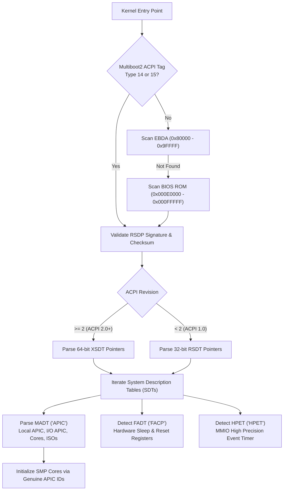

<!-- SPDX-License-Identifier: GPL-2.0-only -->

# ACPI Architecture & Motherboard Topology Discovery

Keira Kernel implements an active, bare-metal Advanced Configuration and Power Interface (ACPI) table parsing engine in `crates/arch/src/power/acpi.rs`. The subsystem dynamically discovers motherboard hardware topology—including physical CPU cores, Local APIC base addresses, I/O APIC interrupt controllers, and Interrupt Source Overrides (ISOs)—replacing legacy CPUID heuristics with authentic firmware-reported hardware configuration.

---

## 1. ACPI Discovery Workflow



---

## 2. Root System Description Pointer (RSDP)

The RSDP is the anchor descriptor located in physical memory on 16-byte boundaries. Keira discovers the RSDP using a prioritized multi-tier search strategy:

1. **Multiboot2 Tags**: Checks Tag `14` (ACPI 1.0 RSDP copy) or Tag `15` (ACPI 2.0+ RSDP copy) passed by modern bootloaders.
2. **Extended BIOS Data Area (EBDA)**: Reads the EBDA segment base address from real-mode BIOS pointer `0x40E` (`(seg << 4)`) and scans the first 1 KiB (`0x80000` to `0x9FFFF`).
3. **Main BIOS ROM**: Scans physical memory range `0x000E0000` through `0x000FFFFF` in 16-byte increments.

### Descriptor Structure (`Rsdp`)

| Field | Type | Offset | Description |
| :--- | :--- | :--- | :--- |
| `signature` | `[u8; 8]` | `0x00` | Signature string `"RSD PTR "` |
| `checksum` | `u8` | `0x08` | First 20 bytes checksum (sums to `0` mod 256) |
| `oem_id` | `[u8; 6]` | `0x09` | OEM identification string (e.g. `"BOCHS "`) |
| `revision` | `u8` | `0x0F` | `0` for ACPI 1.0, `2` for ACPI 2.0+ |
| `rsdt_address` | `u32` | `0x10` | 32-bit physical address of RSDT |
| `length` | `u32` | `0x14` | Total structure length (36 bytes for ACPI 2.0+) |
| `xsdt_address` | `u64` | `0x18` | 64-bit physical address of XSDT |
| `extended_checksum` | `u8` | `0x20` | Entire table checksum (sums to `0` mod 256) |
| `reserved` | `[u8; 3]` | `0x21` | Reserved |

---

## 3. Multiple APIC Description Table (MADT / `"APIC"`)

The MADT describes the system interrupt architecture and multiprocessor topology. It contains a standard 36-byte header followed by variable-length interrupt controller records.

### Record Types Parsed by Keira

#### Type 0: Processor Local APIC
Describes an individual logical processor core.
```text
Offset 0: Type = 0 (1 byte)
Offset 1: Length = 8 (1 byte)
Offset 2: ACPI Processor ID (1 byte)
Offset 3: APIC ID (1 byte)
Offset 4: Flags (4 bytes) -> Bit 0: Processor Enabled, Bit 1: Online Capable
```
When Bit 0 or Bit 1 is set, the processor core is registered in the kernel's SMP topology table (`SMP_CORES`).

#### Type 1: I/O APIC
Describes a motherboard I/O APIC controller responsible for routing hardware IRQs to processor cores.
```text
Offset 0: Type = 1 (1 byte)
Offset 1: Length = 12 (1 byte)
Offset 2: I/O APIC ID (1 byte)
Offset 3: Reserved (1 byte)
Offset 4: I/O APIC MMIO Physical Address (4 bytes, e.g. 0xFEC00000)
Offset 8: Global System Interrupt (GSI) Base (4 bytes)
```

#### Type 2: Interrupt Source Override (ISO)
Describes an ISA hardware interrupt that is remapped to a different Global System Interrupt line on the I/O APIC.
```text
Offset 0: Type = 2 (1 byte)
Offset 1: Length = 10 (1 byte)
Offset 2: Bus = 0 (ISA) (1 byte)
Offset 3: Source Bus IRQ (1 byte, e.g. IRQ 0 for 8254 PIT)
Offset 4: Global System Interrupt (4 bytes, e.g. GSI 2)
Offset 8: Flags (2 bytes) -> Polarity & Trigger Mode
```
This is critical for legacy timer handling (routing 8254 PIT IRQ 0 to I/O APIC redirection table entry 2).

#### Type 5: 64-bit Local APIC Address Override
Specifies a 64-bit physical address for the Local APIC when relocated away from default `0xFEE00000`.
```text
Offset 0: Type = 5 (1 byte)
Offset 1: Length = 12 (1 byte)
Offset 2: Reserved (2 bytes)
Offset 4: 64-bit Local APIC Physical Address (8 bytes)
```

---

## 4. Integration with SMP & Core Initialization

Before initializing secondary Application Processors (APs), `init_smp()` queries the parsed ACPI topology (`acpi::get_acpi_topology()`):

1. **Bootstrap Processor (BSP)**: Detects the active core via Local APIC ID register (`apic::get_current_lapic_id()`) and registers it at `SMP_CORES[0]`.
2. **Application Processors (APs)**: For each core in the MADT record list whose `apic_id != bsp_apic_id`, Keira broadcasts the standard INIT-SIPI-SIPI sequence to `target_apic_id`.
3. **Fallback Mode**: If booting on an ancient architecture or a minimal VM where ACPI is absent, the kernel transparently falls back to CPUID Leaf 1 enumeration without panicking.

---

## 5. Shell Inspection Commands

System administrators can inspect live ACPI hardware topology using the built-in shell:

```bash
# Query active ACPI topology, MADT cores, and watchdog
power acpi
```

### Example Console Output:
```text
ACPI Power Management & Hardware Watchdog:
  ACPI State    : S0 (Working)
  NMI Watchdog  : PETTED / ACTIVE [OK]

Motherboard ACPI Hardware Topology:
  RSDP Status   : Detected (ACPI 2.0+ / XSDT, OEM: BOCHS )
  Local APIC    : 0xFEE00000
  I/O APIC      : 0xFEC00000 (ID: 0, GSI Base: 0)
  MADT Cores    : 4 cores discovered [APIC IDs: 0, 1, 2, 3]
  IRQ Overrides : IRQ 0->GSI 2, IRQ 9->GSI 9
```
