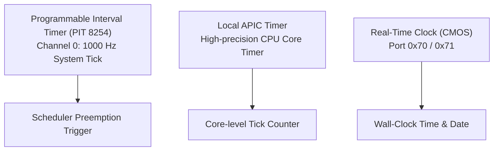

<!-- SPDX-License-Identifier: GPL-2.0-only -->

# Timers, Interrupt Routing & APIC

This document details hardware timer calibration, Local APIC programming, legacy PIC remapping, and Real-Time Clock (RTC) synchronization in Keira Kernel.

---

## Timer Hierarchy

Keira Kernel integrates three tiers of timer hardware:



---

## 8259 PIC Remapping

To avoid vector conflicts with CPU exceptions (`0..31`), the legacy dual 8259 PIC is remapped:
* **Master PIC**: Remapped to vectors `0x20`–`0x27` (IRQs 0..7).
* **Slave PIC**: Remapped to vectors `0x28`–`0x2F` (IRQs 8..15).

```rust
pub unsafe fn remap_pic(offset1: u8, offset2: u8) {
    let a1 = inb(0x21);
    let a2 = inb(0xA1);

    outb(0x20, 0x11); // ICW1: Init Master
    outb(0xA0, 0x11); // ICW1: Init Slave
    outb(0x21, offset1); // ICW2: Master offset (0x20)
    outb(0xA1, offset2); // ICW2: Slave offset (0x28)
    outb(0x21, 4); // ICW3: Master cascade
    outb(0xA1, 2); // ICW3: Slave cascade
    outb(0x21, 0x01); // ICW4: 8086 mode
    outb(0xA1, 0x01);

    outb(0x21, a1); // Restore masks
    outb(0xA1, a2);
}
```
