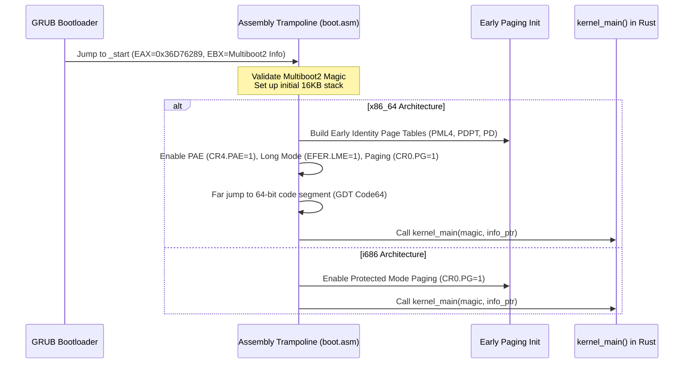

<!-- SPDX-License-Identifier: GPL-2.0-only -->

# Multiboot2 Boot Sequence & Entry Trampolines

This document details the bootstrap process of Keira Kernel from GRUB/Multiboot2 bootloader handoff to the pure Rust `kernel_main()` entry point.

---

## Boot Protocol Specifications

Keira conforms to the **Multiboot2 Specification**:
* **Magic Number**: `0xE85250D6`
* **Architecture Tag**: `0` (i386 / x86_64 protected mode entry)
* **Header Length**: Computed dynamically in assembly.
* **Requested Information Tags**:
  - Memory Map Tag (`Tag 6`)
  - Basic Memory Information (`Tag 4`)
  - Linear Framebuffer Tag (`Tag 8`)
  - Bootloader Name Tag (`Tag 2`)
  - Command Line Arguments (`Tag 1`)

---

## Dual-Architecture Bootstrap Flow



---

## Assembly Entry Trampolines (`arch/x86/x86_64/boot/entry32.asm` & `arch/x86/i686/boot/entry.asm`)

### 1. Stack Allocation
A dedicated 16 KB early stack is allocated in the BSS segment:
```nasm
section .bss
align 16
stack_bottom:
    resb 16384
stack_top:
```

### 2. Magic Verification & Register Preservation
Upon entry at `_start`, the bootloader passes:
* `EAX`: Multiboot2 magic `0x36D76289`.
* `EBX`: 32-bit physical address pointing to the Multiboot2 information structure.

```nasm
_start:
    cli
    cld
    mov esp, stack_top
    push ebx
    push eax
    call verify_multiboot
```

### 3. Rust Entry Point Signature (`crates/kernel/src/entry/mod.rs`)

```rust
#[no_mangle]
pub extern "C" fn kernel_main(magic: u32, multiboot_info_addr: usize) -> ! {
    // 1. Initialize serial COM1 logging immediately
    // 2. Parse Multiboot2 memory tags
    // 3. Initialize Physical Frame Allocator (PMM)
    // 4. Initialize Virtual Memory Paging (VMM)
    // 5. Initialize GDT, IDT, and TSS
    // 6. Enter interactive shell runloop
}
```

---

## Application Processor (AP) Bootstrap Trampoline (`0x8000`)

Secondary CPU cores (Application Processors) awaken in 16-bit Real Mode via Local APIC `INIT-SIPI-SIPI` signals from the Bootstrap Processor (BSP).

### Trampoline Layout (`arch/x86/x86_64/boot/ap_trampoline.asm` & `arch/x86/i686/boot/ap_trampoline.asm`)

The BSP copies the assembled trampoline to fixed physical address `0x8000` (vector `0x08`):

1. **16-Bit Real Mode**:
   - Clears segment registers (`DS`, `ES`, `SS`).
   - Sets temporary stack pointer (`SP = 0x7C00`).
   - Loads temporary 32-bit GDT (`lgdt [0x8000 + gdt_desc_offset]`).
   - Sets `CR0.PE = 1` to enter 32-bit Protected Mode and performs a far jump to segment `0x08`.

2. **32-Bit Protected Mode**:
   - Reloads segment registers with data selector `0x10`.
   - On **i686**: Loads allocated per-CPU stack pointer, pushes `core_id`, and calls `ap_main(core_id)`.
   - On **x86_64**: Loads active `CR3` page directory root, enables `CR4.PAE`, sets `EFER.LME` and `EFER.NXE`, enables paging (`CR0.PG = 1`), loads 64-bit GDT, and far jumps to 64-bit Long Mode.

3. **64-Bit Long Mode (x86_64)**:
   - Sets 64-bit data selector `GDT_DATA64_SEL`.
   - Loads allocated 64-bit per-CPU stack pointer from the parameter block into `RSP`.
   - Passes `core_id` in `RDI` per System V AMD64 ABI.
   - Calls `ap_main(core_id)` in pure Rust.

### Parameter Block Synchronization

The BSP communicates dynamically with each booting AP via a 64-bit aligned parameter block situated at the base of the trampoline:
* `ap_cr3_val`: Physical root address of the active page tables (PML4).
* `ap_stack_val`: Allocated per-CPU stack top (`PER_CPU_STACKS[core_id]`).
* `ap_entry_val`: Function pointer to Rust `ap_main`.
* `ap_core_id`: Unique logical core index ($0 .. N-1$).
* `ap_status_flag`: Atomic handshake flag set to `1` by `ap_main` upon entering Rust.
