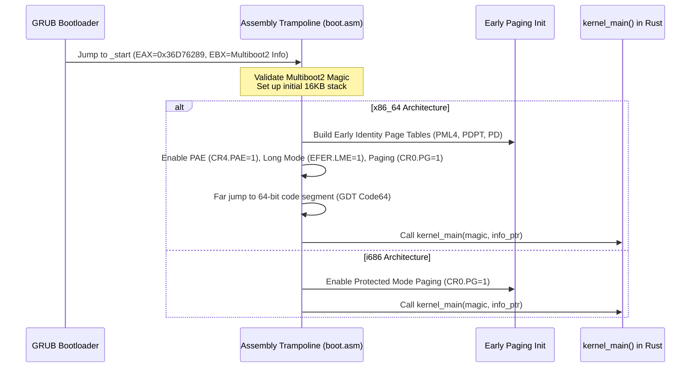

<!-- SPDX-License-Identifier: GPL-2.0-only -->

# Multiboot2 Boot Sequence & Entry Trampolines

This document details the bootstrap process of Keira Kernel from GRUB/Multiboot2 bootloader handoff to the pure Rust `kernel_main()` entry point.

---

## Boot Protocol Specifications

Keira conforms to the **Multiboot2 Specification**:
* **Magic Number**: `0xE85250D6`
* **Architecture Tag**: `0` (i386 / x86_64 protected mode entry)
* **Header Length**: Computed dynamically in assembly.
* **Requested Information Tags**:
  - Memory Map Tag (`Tag 6`)
  - Basic Memory Information (`Tag 4`)
  - Linear Framebuffer Tag (`Tag 8`)
  - Bootloader Name Tag (`Tag 2`)
  - Command Line Arguments (`Tag 1`)

---

## Dual-Architecture Bootstrap Flow



---

## Assembly Entry Trampoline (`arch/x86/boot/boot.asm`)

### 1. Stack Allocation
A dedicated 16 KB early stack is allocated in the BSS segment:
```nasm
section .bss
align 16
stack_bottom:
    resb 16384
stack_top:
```

### 2. Magic Verification & Register Preservation
Upon entry at `_start`, the bootloader passes:
* `EAX`: Multiboot2 magic `0x36D76289`.
* `EBX`: 32-bit physical address pointing to the Multiboot2 information structure.

```nasm
_start:
    cli
    cld
    mov esp, stack_top
    push ebx
    push eax
    call verify_multiboot
```

### 3. Rust Entry Point Signature (`crates/kernel/src/entry/mod.rs`)

```rust
#[no_mangle]
pub extern "C" fn kernel_main(magic: u32, multiboot_info_addr: usize) -> ! {
    // 1. Initialize serial COM1 logging immediately
    // 2. Parse Multiboot2 memory tags
    // 3. Initialize Physical Frame Allocator (PMM)
    // 4. Initialize Virtual Memory Paging (VMM)
    // 5. Initialize GDT, IDT, and TSS
    // 6. Enter interactive shell runloop
}
```
