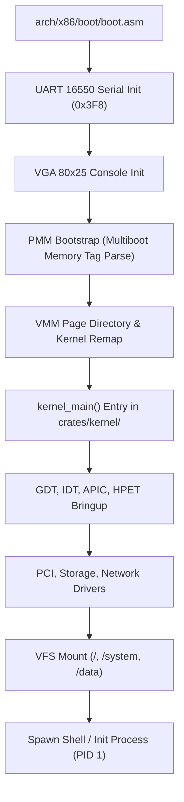

<!-- SPDX-License-Identifier: GPL-2.0-only -->

# Early Kernel Bringup & Initialization Sequence

The early bringup sequence transitions the CPU from early assembly bootstrap to the high-level `#![no_std]` Rust kernel runtime.

---

## 1. Initialization Timeline

---

## 2. Low-Level Subsystem Initialization Checklist

Inside `crates/kernel/src/lib.rs`:

1. **Early Diagnostic Output**:
   * UART 16550 configured to 115200 baud, 8N1 format.
   * Enables immediate kernel logging via `early_printk!()`.
2. **Physical Frame Allocator (PMM)**:
   * Maps physical memory regions from Multiboot memory map.
   * Initializes frame allocation bitmap.
3. **Virtual Memory Manager (VMM)**:
   * Identity maps early boot pages and maps higher-half kernel space (`0xC0000000` or `0xFFFF800000000000`).
4. **Segmentation & Interrupts**:
   * Installs Global Descriptor Table (GDT) and loads Task State Segment (TSS).
   * Installs Interrupt Descriptor Table (IDT) with 256 gates.
5. **Timer & Interrupt Controller**:
   * Disables legacy 8259 PIC.
   * Calibrates Local APIC timer using HPET or PIT.
6. **Task & Scheduler Subsystem**:
   * Initializes idle task (PID 0) and preemptive round-robin scheduler.
