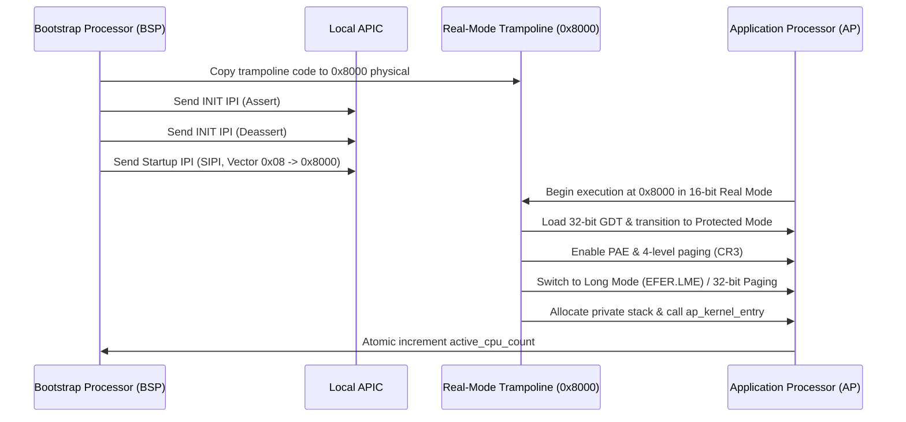

<!-- SPDX-License-Identifier: GPL-2.0-only -->

# Symmetric Multiprocessing (SMP) & AP Trampoline

Keira boots all Application Processors (APs) using an assembly real-mode trampoline adhering to the Intel MultiProcessor and ACPI specifications.

---

## 1. SMP Bringup Architecture

---

## 2. Real-Mode Trampoline Placement (`0x8000`)

The Startup IPI (SIPI) accepts an 8-bit vector designating the 4 KiB memory page where execution begins:
$$\text{Physical Address} = \text{Vector} \times 4096$$
Vector `0x08` maps directly to physical address `0x00008000`, located safely within conventional memory below the 1 MiB boundary.

---

## 3. Trampoline State Transitions

1. **16-bit Real Mode**: Sets segments to zero, disables interrupts, loads temporary 32-bit GDT via `lgdt`.
2. **32-bit Protected Mode**: Sets `CR0.PE = 1`, performs far jump to 32-bit code segment.
3. **Paging Setup**: Loads BSP kernel page directory pointer into `CR3`.
4. **64-bit Long Mode Transition (on x86_64)**: Sets `CR4.PAE = 1`, `EFER.LME = 1`, and enables paging `CR0.PG = 1`.
5. **Private Stack Allocation**: Reads CPU Local APIC ID, indexes into per-CPU stack array, and loads stack pointer (`RSP` / `ESP`).
6. **Kernel Entry**: Calls `ap_startup_entry()` in Rust kernel core.
