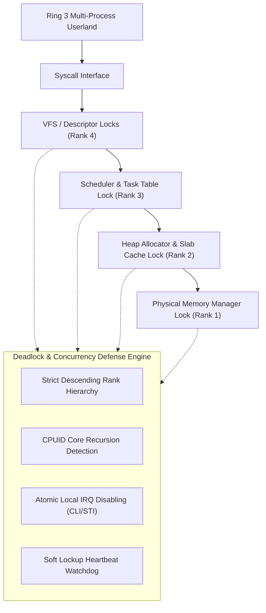
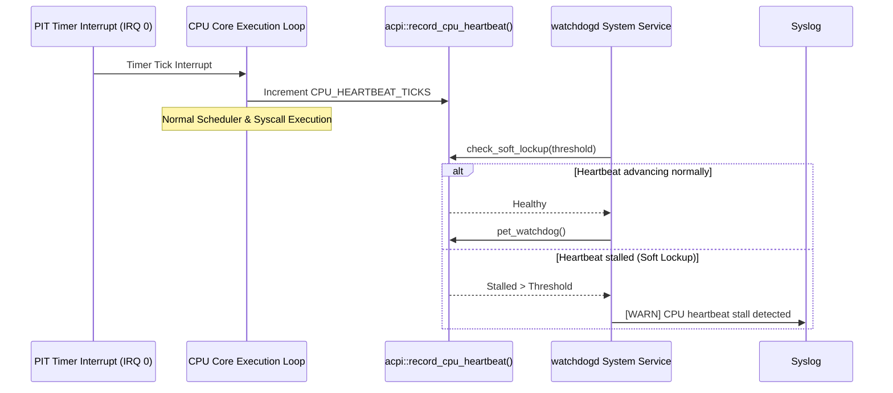

<!-- SPDX-License-Identifier: GPL-2.0-only -->

# SMP Concurrency & Deadlock Defense Architecture

Keira Kernel implements a deterministic, multi-core concurrency control architecture engineered to eliminate race conditions, circular-wait deadlocks, and interrupt inversion bugs across freestanding kernel subsystems.

---

## Architecture Overview



---

## 1. Interrupt-Safe Spinlocks (`IrqSpinLock`)

Standard spinlocks in operating system kernels are vulnerable to interrupt handler inversion deadlocks: if CPU Core $N$ acquires a spinlock while interrupts are enabled, and a hardware timer interrupt fires on Core $N$ whose ISR attempts to acquire the same lock, Core $N$ will spin indefinitely waiting for itself to release the lock.

Keira solves this through `IrqSpinLock`:
- **Atomic IRQ Disabling**: Saves the local CPU `RFLAGS.IF` interrupt enable flag and executes `cli` before attempting to acquire the lock.
- **Interrupt State Preservation**: Tracks whether interrupts were previously enabled in `IrqState`. Unlocking the lock restores `IF` only if it was enabled prior to lock acquisition, safely allowing arbitrary lock nesting without prematurely re-enabling interrupts.
- **RAII Scoped Guard**: `IrqSpinLock::lock()` yields an `IrqSpinLockGuard` implementing `Drop`, guaranteeing lock release and IRQ restoration even on early returns or error paths.

```rust
pub struct IrqSpinLock {
    locked: AtomicBool,
    saved_irq: AtomicBool,
    saved_rank: AtomicU8,
    holder_core: AtomicI32,
    rank: LockRank,
}
```

---

## 2. Lock Ordering Hierarchy (`LockRank`)

To eliminate Coffman circular wait deadlocks, Keira establishes a formal lock ranking hierarchy. Subsystems must acquire locks strictly in descending order:

$$\text{LockRank::Vfs (4)} \longrightarrow \text{LockRank::Scheduler (3)} \longrightarrow \text{LockRank::Heap (2)} \longrightarrow \text{LockRank::Pmm (1)}$$

| Rank | Identifier | Subsystem / Protected Resource | Acquisition Policy |
| :--- | :--- | :--- | :--- |
| **0** | `LockRank::None` | Unranked leaf locks | No nested lock dependencies |
| **1** | `LockRank::Pmm` | Physical Frame Allocator (`PMM_LOCK`) | Lowest ranked primitive; holds no other locks |
| **2** | `LockRank::Heap` | Kernel Heap (`HEAP_LOCK`) & Slab (`KmemCache`) | May acquire Pmm, but never Scheduler or Vfs |
| **3** | `LockRank::Scheduler` | Multitasking Scheduler (`SCHEDULER_LOCK`) | May acquire Heap or Pmm during task allocation |
| **4** | `LockRank::Vfs` | Virtual File System & Descriptor Locks | May acquire Scheduler, Heap, or Pmm |

Any attempt to acquire a lock whose numerical rank is greater than or equal to the currently held rank triggers a lock order inversion error:

```rust
if current != 0 && target >= current {
    return Err("Lock order inversion: attempted to acquire higher or equal rank while holding lock");
}
```

---

## 3. Core ID Resolution & Recursion Detection

Keira detects intra-core re-entrancy bugs by inspecting hardware core IDs:
- **Zero Dependencies**: Core ID resolution is performed directly via CPUID leaf 1 (`ebx >> 24`) in freestanding mode, allowing `keira-core` to operate without dependencies on architecture or scheduler crates.
- **Recursion Panic**: If Core $N$ attempts to re-acquire an `IrqSpinLock` that is already held by Core $N$, the kernel immediately triggers a panic with diagnostic CPU information rather than silently locking up.

---

## 4. Upgraded Subsystem Locking

### Kernel Heap & Slab Cache
- `HEAP_LOCK` is upgraded to `IrqSpinLock::with_rank(LockRank::Heap)`. All allocation routines (`kmalloc`, `kfree`, `heap_init`) utilize RAII scoped guards to guarantee zero lock leaks on error branches.
- `KmemCache` uses `IrqSpinLock::with_rank(LockRank::Heap)`. When filling or reaping descriptor caches, `KmemCache` unlocks its internal list before delegating to `kmalloc` or `kfree`, preventing lock nesting.

### Scheduler & Task Table
- `SCHEDULER_LOCK` protects concurrent task lifecycle state transitions: `fork_current_task`, `exit_current`, `sys_waitpid`, and `reap_orphaned_zombies`.
- Non-blocking wait loops release `SCHEDULER_LOCK` prior to yielding CPU execution (`int 32`), guaranteeing zero scheduler lock starvation.

---

## 5. Soft Lockup & Watchdog Heartbeat Monitoring



- **Tick Heartbeat**: Every scheduler timer interrupt invokes `record_cpu_heartbeat()`, atomically updating tick counters.
- **Service Supervision**: The `watchdogd` kernel service polls `check_soft_lockup()` periodically and invokes `pet_watchdog()`. If a kernel thread or spinlock loops excessively without servicing interrupts, `watchdogd` logs an alert to `/data/log/syslog.log`.

---

## 6. Ring 3 Verification & Fault Containment

The Ring 3 verification harness (`user/bin/test_abi/main.c`) validates SMP concurrency defenses through automated end-to-end tests:
- **Test 38 (`Multi-process concurrent syscall & memory stress`)**: Spawns concurrent worker processes performing intensive heap expansions (`sbrk`), memory allocations, descriptor cloning (`dup`), and inter-process pipe transfers under preemptive timer slicing without data corruption.
- **Test 39 (`Lock contention & non-blocking deadlock immunity`)**: Spawns contending worker processes on exclusive advisory file locks, verifying that `EACCES` is delivered without scheduler deadlock and non-blocking `WNOHANG` options return immediately.
