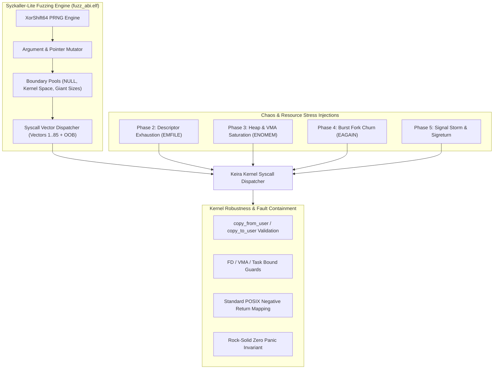

<!-- SPDX-License-Identifier: GPL-2.0-only -->

# Automated Syscall Fuzzing & Chaos Stress Architecture

Keira Kernel incorporates an automated, high-throughput system call fuzzing and chaos engineering framework designed to certify kernel reliability, memory safety, and panic immunity under extreme and adversarial Ring 3 conditions.

---

## Architecture Overview

---

## 1. Mutation Strategy & Boundary Pool

The fuzzing engine (`user/bin/fuzz_abi/main.c`) generates pseudo-random input combinations tailored to expose edge cases in kernel entry points:

### Boundary Value Pool
- **NULL Pointer Dereference**: `0x0000000000000000`.
- **Kernel Space Boundary**: `0xFFFF800000000000` (x86_64 higher-half canonical address) and `0xC0000000` (i686 3GB boundary).
- **Misaligned Pointers**: `0x1001`, `0x4000`, `0x10000`.
- **Integer Limits**: `0`, `1`, `-1` (`0xFFFFFFFFFFFFFFFF`), `0x7FFFFFFF` (`INT_MAX`), `0x80000000` (`INT_MIN`), `0xFFFFFFFF` (`UINT32_MAX`), `0x7FFFFFFFFFFFFFFF` (`INT64_MAX`).
- **Sentinel Magic**: `0xDEADBEEF`, `0x00007FFFFFFFFFFF` (highest canonical user address).

### Argument Selection Heuristics
1. **40% Probability**: Select from the curated boundary value pool.
2. **20% Probability**: Select small integers ($0 \le N < 64$) for file descriptors and signal numbers.
3. **20% Probability**: Point to an active valid userland stack/data buffer with random offsets.
4. **20% Probability**: Generate arbitrary 64-bit pseudo-random values.

---

## 2. System Call Vector Coverage

The fuzzer covers all **81 active system call vectors** supported by Keira across `x86_64` (`syscall`) and `i686` (`int 0x80`), plus intentional out-of-range numbers:

| Category | Vectors | Fuzzing Guard & Safety Invariant |
| :--- | :--- | :--- |
| **Process Control** | `SYS_EXIT` (2), `SYS_EXEC` (5) | Isolated in child forks (`fork()`); parent immediately reaps to prevent harness self-termination. |
| **Process Cloning** | `SYS_FORK` (30) | Child process exits immediately (`_exit(0)`) to prevent uncontrolled fork bombing. |
| **Timers & Sleep** | `SYS_SLEEP` (3), `SYS_NANOSLEEP` (67) | Clamped to zero-delay values to prevent fuzzer stalls. |
| **Process Synchronization** | `SYS_WAIT` (13), `SYS_WAITPID` (62) | Non-blocking flag (`WNOHANG`) strictly enforced. |
| **Console Output** | `SYS_PUTC` (1) | Argument muted to prevent console buffer flooding during rapid loops. |
| **Out-of-Bounds & Unassigned** | `0`, `18`, `19`, `26`, `27`, `86`, `999` | Strictly verified to return standard `-ENOSYS`. |

---

## 3. Chaos Stress Injection Modules

Beyond randomized fuzzing, `fuzz_abi.elf` executes five dedicated stress modules:

### Phase 1: Vector Fuzzing (10,000 Iterations)
Executes 10,000 consecutive mutated syscall vectors. Every vector must return a deterministic status code (either positive success or standard negative errno: `-EFAULT`, `-EINVAL`, `-EBADF`, `-ENOMEM`, `-EAGAIN`, `-ENOSYS`). Under no condition may the kernel crash, panic, or trigger a page fault in kernel space.

### Phase 2: File Descriptor Table Exhaustion
Repeatedly opens descriptors until the process table reaches capacity (`EMFILE`). Verifies that:
1. The kernel rejects further descriptor allocations cleanly with `-EMFILE`.
2. Closing all open descriptors returns all descriptor slots to the process pool.
3. Subsequent `open()` immediately succeeds without descriptor leakage.

### Phase 3: Memory Boundary & Heap Churn
1. Requests an extreme allocation (`sbrk(1GB)`) exceeding system RAM; verifies graceful rejection (`-ENOMEM`).
2. Performs valid heap expansion (`sbrk(4096)`), writes memory patterns (`0xAA`), validates data integrity, and retracts the heap break (`sbrk(-4096)`).
3. Rapidly maps and unmaps anonymous pages at virtual address boundaries via `mmap` / `munmap`.

### Phase 4: Rapid Process Churn & PID Rollover
Burst-forks 16 concurrent worker tasks that perform internal computations and exit with status code 42. The parent reaps all children using `waitpid()`, verifying:
1. All child exit codes are correctly reported.
2. Zombie slots are completely purged from `TASKS`.
3. Process tables and kernel stacks remain pristine.

### Phase 5: High-Frequency Signal Storm
Registers a `SIGUSR1` signal handler and dispatches a burst of 50 consecutive asynchronous signals to itself using `kill(getpid(), SIGUSR1)`. Verifies:
1. Every signal is intercepted and handled by the userland callback.
2. Kernel preserves and restores the user register context upon `sys_sigreturn`.
3. Stack alignment and execution flow remain uncorrupted.

---

## 4. Verification & Certification Metrics

Keira Kernel v0.4.0 is certified for production readiness when:
- **Zero Kernel Panics**: 10,000+ continuous randomized syscall invocations with mutated arguments result in 0 kernel panics.
- **Clean Errno Mapping**: 100% of rejected system calls return valid POSIX error codes.
- **Resource Neutrality**: Complete reclamation of descriptors, heap allocations, and process slots following chaos stress runs.
- **Regression Parity**: Both `test_abi.elf` (42 comprehensive unit tests) and `fuzz_abi.elf` pass without errors.
