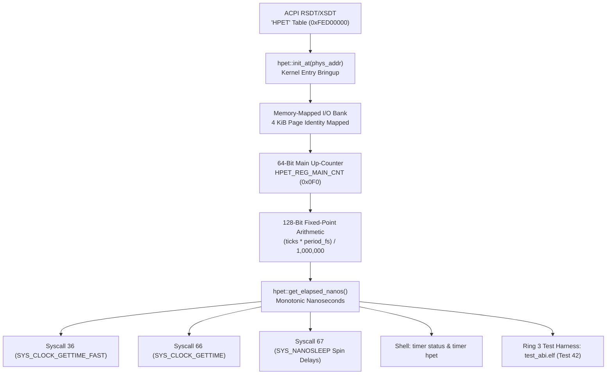

<!-- SPDX-License-Identifier: GPL-2.0-only -->

# High-Precision Event Timer (HPET) Sub-Nanosecond Hardware Driver

This document details the architecture, memory-mapped register interface, sub-nanosecond clock mathematics, dual-architecture atomic access, and userland syscall integration for the High-Precision Event Timer (HPET) driver in Keira Kernel.

---

## 1. Architectural Overview

The High-Precision Event Timer (IA-PC HPET Specification Rev 1.0a) provides monotonic, high-resolution timekeeping and interval timing designed to supersede legacy 8254 Programmable Interval Timers (PIT) and RTC periodic timers.

Keira's HPET driver (`crates/arch/src/timers/hpet.rs`) operates as the kernel's primary sub-nanosecond monotonic clock source:



---

## 2. Memory-Mapped Register Layout

The HPET register block occupies a 1024-byte (1 KiB) region in physical memory, mapped by default at `0xFED0_0000` or discovered dynamically via the ACPI `"HPET"` description table:

| Offset | Register Name | Width | Access | Description |
| :--- | :--- | :--- | :--- | :--- |
| `0x000` | `GCAP_ID` | 64-bit | RO | General Capabilities and ID (Vendor ID, Revision, Period, Timer Count, 64-bit Capable) |
| `0x010` | `GEN_CONF` | 64-bit | R/W | General Configuration (`ENABLE_CNF` bit 0, `LEG_RT_CNF` bit 1) |
| `0x020` | `GINTR_STA` | 64-bit | R/W1C | General Interrupt Status for all comparator channels |
| `0x0F0` | `MAIN_CNT` | 64-bit | R/W | 64-bit continuous main up-counter |
| `0x100 + 0x20*n` | `Tn_CONF` | 64-bit | R/W | Timer $n$ Configuration and Capability (Periodic, Edge/Level, Interrupt Route) |
| `0x108 + 0x20*n` | `Tn_COMP` | 64-bit | R/W | Timer $n$ Comparator Value |
| `0x110 + 0x20*n` | `Tn_FSB` | 64-bit | R/W | Timer $n$ FSB / MSI Interrupt Route |

### General Capabilities Register (`GCAP_ID`) Bit Allocation:
- **Bits `7:0`**: `REV_ID` - Hardware revision number.
- **Bits `12:8`**: `NUM_TIM_CAP` - Number of hardware comparators minus 1.
- **Bit `13`**: `COUNT_SIZE_CAP` - Counter width (`1` = 64-bit wide, `0` = 32-bit only).
- **Bit `15`**: `LEG_RT_CAP` - Legacy replacement interrupt routing support (IRQ0/IRQ8).
- **Bits `31:16`**: `VENDOR_ID` - PCI vendor ID of the timer implementation.
- **Bits `63:32`**: `COUNTER_CLK_PERIOD` - Clock tick period in femtoseconds ($10^{-15}$ seconds). Must satisfy $0 < \text{period} \le 10^8$ fs ($\le 100$ ns).

---

## 3. Sub-Nanosecond Clock Mathematics

The main up-counter ticks continuously at an invariant frequency determined by `COUNTER_CLK_PERIOD`. Because standard femtoseconds are $10^{-15}$ seconds and nanoseconds are $10^{-9}$ seconds, exactly $1,000,000$ femtoseconds make one nanosecond.

To eliminate integer truncation and prevent 64-bit integer overflow during arithmetic multiplications:

$$\text{Total Nanoseconds} = \frac{\text{ticks} \times \text{period\_fs}}{1,000,000}$$

$$\text{Frequency (Hz)} = \frac{10^{15}}{\text{period\_fs}}$$

Keira executes this computation using 128-bit unsigned arithmetic (`u128`):

```rust
pub fn ticks_to_nanos(ticks: u64) -> u64 {
    let period_fs = unsafe { HPET_PERIOD_FS };
    if period_fs == 0 {
        return 0;
    }
    ((ticks as u128 * period_fs as u128) / (FEMTOSECONDS_PER_NANOSECOND as u128)) as u64
}
```

A 64-bit nanosecond counter will not roll over for over 584 years ($2^{64} \text{ ns} \approx 1.84 \times 10^{19} \text{ ns}$).

---

## 4. Dual-Architecture Atomic MMIO Access

HPET registers are 64-bit wide. While `x86_64` can read 64-bit MMIO atomically in a single volatile load, `i686` (32-bit Protected Mode) requires two sequential 32-bit bus cycles.

To prevent reading torn values when the lower 32-bit word rolls over into the upper 32-bit word, Keira implements an atomic double-read loop on `i686`:

```rust
#[cfg(target_arch = "x86")]
unsafe fn read_reg64(offset: usize) -> u64 {
    let base = HPET_BASE_ADDR as usize + offset;
    let low_ptr = base as *const u32;
    let high_ptr = (base + 4) as *const u32;
    loop {
        let high1 = core::ptr::read_volatile(high_ptr);
        let low = core::ptr::read_volatile(low_ptr);
        let high2 = core::ptr::read_volatile(high_ptr);
        if high1 == high2 {
            return ((high1 as u64) << 32) | (low as u64);
        }
    }
}
```

This guarantees lock-free, race-free 64-bit reads across all 32-bit and 64-bit kernel paths.

---

## 5. System Call Integration

Keira wires the HPET driver directly into Ring 3 system calls:

1. **`SYS_CLOCK_GETTIME_FAST` (Syscall 36)**:
   Returns monotonic nanoseconds directly in the accumulator (`RAX` / `EAX`) without userspace buffer copying overhead. Falls back to PIT milliseconds ($\times 1,000,000$) if HPET is unavailable.

2. **`SYS_CLOCK_GETTIME` (Syscall 66)**:
   Populates standard POSIX `struct timespec` (`tv_sec`, `tv_nsec`) with nanosecond fidelity:
   ```rust
   let (sec, nsec) = if keira_arch::timers::hpet::is_initialized() {
       let nanos = keira_arch::timers::hpet::get_elapsed_nanos();
       ((nanos / 1_000_000_000) as i64, (nanos % 1_000_000_000) as i64)
   } else {
       let uptime = unsafe { get_uptime_ms() };
       ((uptime / 1000) as i64, ((uptime % 1000) * 1_000_000) as i64)
   };
   ```

3. **`SYS_NANOSLEEP` (Syscall 67)**:
   Provides high-precision sub-millisecond delays through calibrated HPET counter spinloops (`hpet::delay_nanos`), preventing sub-millisecond requested timeouts from truncating to zero.

---

## 6. Shell Inspection & Diagnostics

The kernel shell provides real-time hardware diagnostics via `timer hpet` and `timer status`:

```text
admin@keira:~$ timer hpet
High-Precision Event Timer (HPET) Hardware Diagnostics:
  MMIO Base Address: 0xFED00000
  PCI Vendor ID    : 0x8086 (Revision: 1)
  Hardware Timers  : 3 comparators available
  Counter Width    : 64-bit wide
  Legacy Routing   : Supported (IRQ0/IRQ8 legacy route)
  Clock Period     : 10000000 femtoseconds (10.0 ns)
  Operating Freq   : 100.0 MHz
  Live Main Counter: 1248903 ticks
  Elapsed Monotonic: 0 s 12 ms
  Resolution Engine: Sub-nanosecond fixed-point (128-bit math)
```

---

## 7. Verification & Ring 3 Test Harness

HPET capabilities and monotonic progress are verified continuously across host and guest environments:

- **Host Unit Tests (`crates/arch/src/timers/hpet.rs`)**:
  Simulates MMIO registers safely via mock structures, validating capability extraction, 100 MHz clock period math, monotonic counter increments, and invalid period rejections.
- **Ring 3 Verification Harness (`test_abi.elf` Test 42)**:
  Directly invokes `clock_gettime(CLOCK_MONOTONIC)` and `syscall(SYS_CLOCK_GETTIME_FAST)`, validates monotonic forward progression across CPU workloads, and ensures delta elapsed time is strictly positive without regressions.
