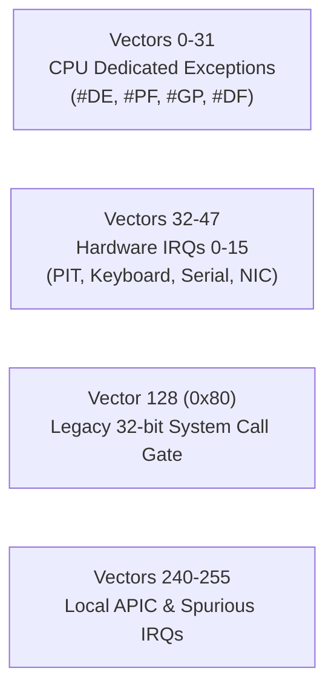

<!-- SPDX-License-Identifier: GPL-2.0-only -->

# Interrupt Descriptor Table (IDT) & Exception Handling

This document specifies the 256-entry Interrupt Descriptor Table (IDT), CPU exception dispatchers, and hardware interrupt (IRQ) routing in Keira Kernel.

---

## IDT Vector Allocation Map

The 256 IDT gates are organized into distinct functional ranges:



---

## Critical CPU Exception Handlers

| Vector | Exception Code | Name | Action Taken |
| :--- | :--- | :--- | :--- |
| `0x00` | `#DE` | Divide-by-Zero | Trigger SIGFPE or kernel panic if in Ring 0 |
| `0x06` | `#UD` | Invalid Opcode | Terminate faulted Ring 3 task or panic kernel |
| `0x08` | `#DF` | Double Fault | Switch to dedicated IST1 stack and dump registers |
| `0x0D` | `#GP` | General Protection Fault | Check privilege violation, segment limits, or GP error code |
| `0x0E` | `#PF` | Page Fault | Read `CR2` fault address; allocate on-demand frame or trigger segmentation fault |

---

## IDT Gate Descriptor Layout (`crates/arch/src/x86_64/idt.rs`)

```rust
#[repr(C, packed)]
pub struct IdtEntry {
    offset_low: u16,       // Offset bits 0..15
    selector: u16,         // Target GDT code selector (0x08)
    ist: u8,               // Interrupt Stack Table index (0..7)
    type_attr: u8,         // Gate type (0x8E = 64-bit Interrupt Gate, DPL=0)
    offset_mid: u16,       // Offset bits 16..31
    offset_high: u32,      // Offset bits 32..63
    reserved: u32,
}
```
