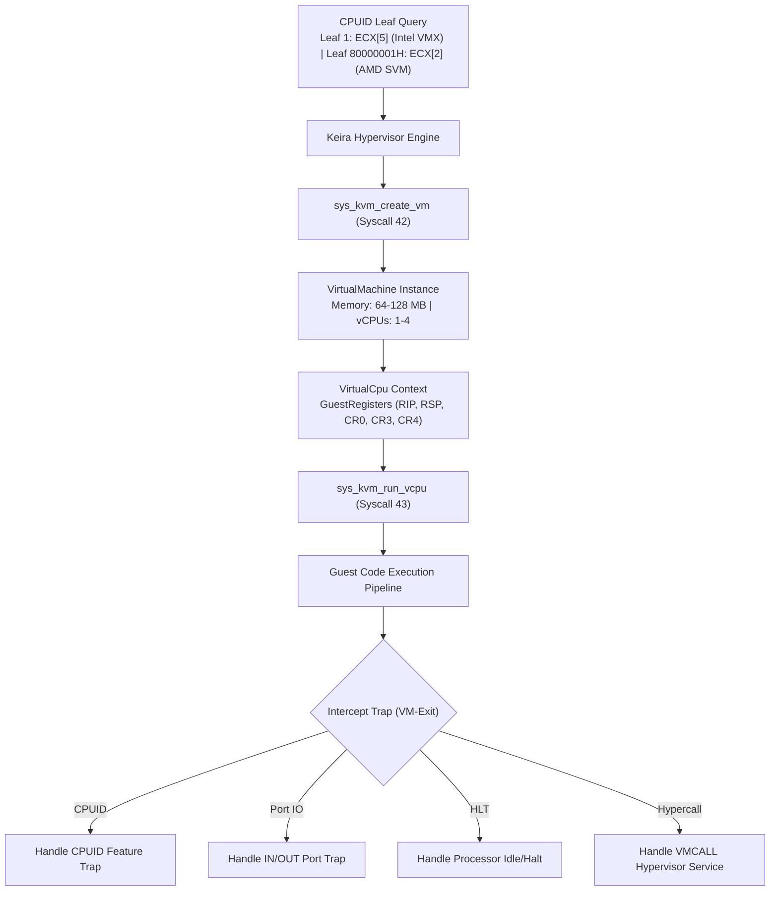

<!-- SPDX-License-Identifier: GPL-2.0-only -->

# Kernel-based Virtual Machine (KVM) & Hardware Virtualization

This document specifies the Kernel-based Virtual Machine (KVM) subsystem architecture, CPU hardware virtualization detection (Intel VMX / AMD SVM), guest execution pipelines, VM-exit handling, and virtualization system calls in Keira Kernel.

---

## Hardware Virtualization Architecture



---

## Hardware Detection (`VirtHardware`)

Virtualization instruction set support is probed at boot via CPUID:

| Extension | Architecture | CPUID Leaf & Register | Detection Bit |
| :--- | :--- | :--- | :--- |
| **Intel VT-x (VMX)** | `x86_64` / `i686` | Leaf `1`, Register `ECX` | Bit 5 (`1 << 5`) |
| **AMD-V (SVM)** | `x86_64` / `i686` | Extended Leaf `0x8000_0001`, Register `ECX` | Bit 2 (`1 << 2`) |

---

## Guest Register Context (`GuestRegisters`)

Standard 64-bit architectural register state preserved across VM-entry and VM-exit transitions:

```rust
#[repr(C)]
pub struct GuestRegisters {
    pub rax: u64, pub rbx: u64, pub rcx: u64, pub rdx: u64,
    pub rsi: u64, pub rdi: u64, pub rsp: u64, pub rbp: u64,
    pub r8: u64,  pub r9: u64,  pub r10: u64, pub r11: u64,
    pub r12: u64, pub r13: u64, pub r14: u64, pub r15: u64,
    pub rip: u64, pub rflags: u64,
    pub cr0: u64, pub cr3: u64, pub cr4: u64,
}
```

Initial baseline reset vector is configured to `0x0000_FFF0` with stack pointer at `0x0000_7C00`.

---

## VM-Exit Reasons (`VmExitReason`)

VM-exits capture privileged instructions intercepted by the hypervisor:

* `1`: `IoInstruction`: Port I/O emulation (`IN` / `OUT`).
* `2`: `Hlt`: CPU halt state.
* `3`: `Cpuid`: CPU feature querying.
* `4`: `CrAccess`: Control register modification (`CR0`, `CR3`, `CR4`).
* `5`: `EptViolation`: Nested paging translation fault.
* `6`: `Hypercall`: Explicit hypercall transition (`VMCALL` / `VMMCALL`).
* `7`: `Shutdown`: Guest triple fault.

---

## System Calls

| Syscall Number | Function Name | Arguments | Description |
| :--- | :--- | :--- | :--- |
| **42** | `sys_kvm_create_vm` | *None* | Allocates an isolated guest VM context and returns `vm_id` |
| **43** | `sys_kvm_run_vcpu` | `arg1 = vm_id`, `arg2 = vcpu_id` | Executes guest instruction pipeline until next VM-exit event |

---

## Shell Command Usage (`kvm`)

```bash
# Inspect CPU virtualization capabilities and VM state
keira> kvm status
Kernel-based Virtual Machine (KVM) Subsystem [Active]
  Hardware Ext: Intel VMX=YES, AMD SVM=NO
  Hypervisor  : Active (Bare-Metal KVM Engine)
  Guest VMs   : 1 allocated (Max: 4)
  Total Exits : 0 transitions handled
  Syscalls    : 42 (kvm_create_vm), 43 (kvm_run_vcpu)

# List active guest virtual machines
keira> kvm list
VM ID   Status    Memory (MB)   vCPUs   Total VM-Exits
  #1    Active    128 MB          1       0

# Execute instruction step on vCPU #0
keira> kvm run 1 0
vCPU Execution Transition (VM #1, vCPU #0):
  Exit Reason : CPUID Instruction (Code 3)
  Guest RIP   : 0x0000FFF2
  Guest RSP   : 0x00007C00
  Guest CR0   : 0x60000010
  Total Exits : 1

# Inspect architectural registers for vCPU
keira> kvm vcpu 1 0

# Run automated KVM self-test
keira> kvm test
[TEST] Executing Kernel Virtual Machine (KVM) Self-Test...
  1. Hardware CPUID virtualization probe completed - OK
  2. Allocated virtual machine #2 context - OK
  3. Verified reset register baseline (RIP: 0x0000FFF0) - OK
  4. Executed vCPU instruction pipeline (Exit Code 3) - OK
  5. VM context unmapped and destroyed - OK
[PASS] Kernel-based Virtual Machine Subsystem operational.
```
