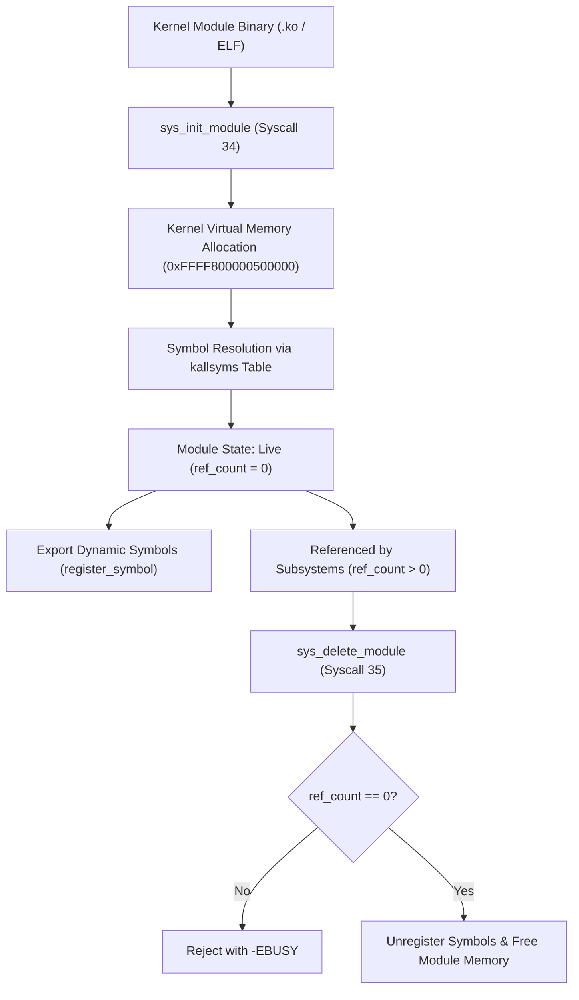

<!-- SPDX-License-Identifier: GPL-2.0-only -->

# Loadable Kernel Modules (LKM) & Dynamic Symbols

This document specifies the Loadable Kernel Module (LKM) subsystem architecture, runtime symbol resolution (`kallsyms`), module lifecycle state machines, and system calls in Keira Kernel.

---

## Module Lifecycle & Symbol Resolution Architecture



---

## Module Descriptor Structure (`KernelModule`)

Each loaded kernel module is tracked in the global `MODULE_TABLE` via `KernelModule`:

```rust
pub struct KernelModule {
    pub name: [u8; MAX_MODULE_NAME],
    pub name_len: usize,
    pub size: usize,
    pub state: ModuleState,
    pub ref_count: u32,
    pub load_address: u64,
    pub description: &'static str,
}
```

### Module Lifecycle States

* `Unloaded`: Slot is vacant or module has been completely unmapped.
* `Loading`: Module initialization routine is executing.
* `Live`: Module is active, exported symbols are accessible, and serving kernel calls.
* `Unloading`: Module cleanup routine is active, preparing for memory release.

---

## Dynamic Symbol Table (`kallsyms`)

Exported symbols provide address resolution for module linking. Keira Kernel maintains:

1. **Base Kernel Symbols (`BASE_KALLSYMS`)**: Core kernel functions exported directly to loadable modules:
   * `vga_print_str`, `vga_set_color`: Display console output.
   * `klog_write`: Kernel logging ring buffer.
   * `pmm_alloc_frame`, `pmm_free_frame`: Physical page frame allocator (`[GPL]`).
   * `vmm_map_page`: Virtual memory mapping (`[GPL]`).
   * `scheduler_yield`: Task scheduler yield vector.
   * `timer_get_ticks`: High-resolution timer ticks.
   * `ext4_mount`, `ext4_lookup`: EXT4 filesystem driver entry points (`[GPL]`).
2. **Dynamic Module Symbols (`DYNAMIC_SYMBOLS`)**: Dynamically exported entry points registered by loaded modules via `register_symbol()`.

---

## System Calls

| Syscall Number | Function Name | Arguments | Description |
| :--- | :--- | :--- | :--- |
| **34** | `sys_init_module` | `arg1 = name_ptr`, `arg2 = size` | Loads, links, and registers a kernel module |
| **35** | `sys_delete_module` | `arg1 = name_ptr`, `arg2 = flags` | Unloads module if reference count is zero |

---

## Shell Command Usage (`lkm`)

```bash
# Display LKM subsystem status
keira> lkm status
Loadable Kernel Module (LKM) Subsystem [Active]
  Status      : Online (Syscall 34 & 35 active)
  Loaded Mods : 3 / 16 active
  Symbol Table: 10 base symbols exported
  Syscalls    : 34 (init_module), 35 (delete_module)

# Display loaded modules in standard Linux lsmod format
keira> lkm lsmod
Module                  Size  Used by  State     Load Address
ext4_fs                65536        1  Live      0xFFFF800000400000
e1000_nic              32768        0  Live      0xFFFF800000410000
ahci_sata              24576        2  Live      0xFFFF800000420000

# Inspect kallsyms symbol table
keira> lkm symbols

# Execute automated LKM self-test
keira> lkm test
[TEST] Executing Loadable Kernel Module Subsystem Self-Test...
  1. Verified static kallsyms resolution (vga_print_str -> 0xFFFF800000101000) - OK
  2. Registered and resolved dynamic module symbol - OK
  3. Registered active module 'diag_probe' (8192 bytes) - OK
  4. Query and descriptor verification from module table - OK
  5. Unloaded and unmapped module 'diag_probe' - OK
[PASS] Loadable Kernel Module Subsystem operational.
```
