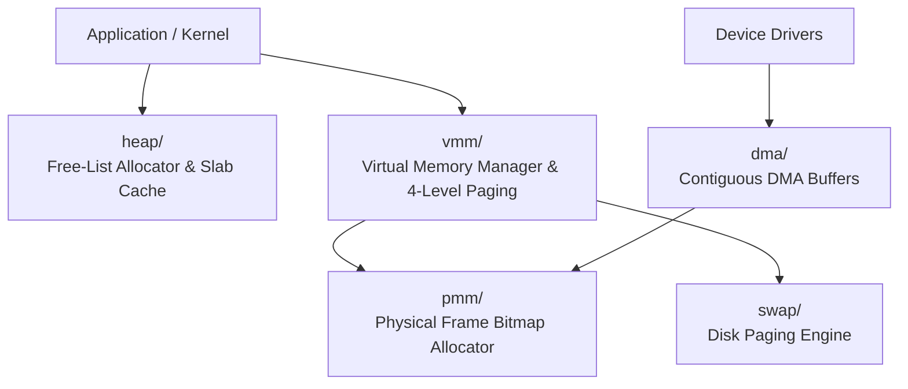

<!-- SPDX-License-Identifier: GPL-2.0-only -->

# Keira Memory Management Subsystems

The `memory` domain encompasses physical frame management, virtual memory paging, dynamic heap allocation, swap partitions, and DMA buffering.

---

## Memory Architecture

---

## Submodule Index

| Submodule | Focus Area | Description |
| :--- | :--- | :--- |
| [`pmm/`](pmm/README.md) | Physical Memory | Bitmap allocator, usable memory regions, physical frames |
| [`vmm/`](vmm/README.md) | Virtual Memory | 4-level/2-level paging, address spaces, page fault handler |
| [`heap/`](heap/README.md) | Kernel Heap | Segregated free-list, size classes, slab object caching |
| [`swap/`](swap/README.md) | Swap Engine | Disk-backed virtual memory paging and page-out daemon |
| [`dma/`](dma/README.md) | DMA Buffering | Physically contiguous, non-cached direct memory access buffers |
