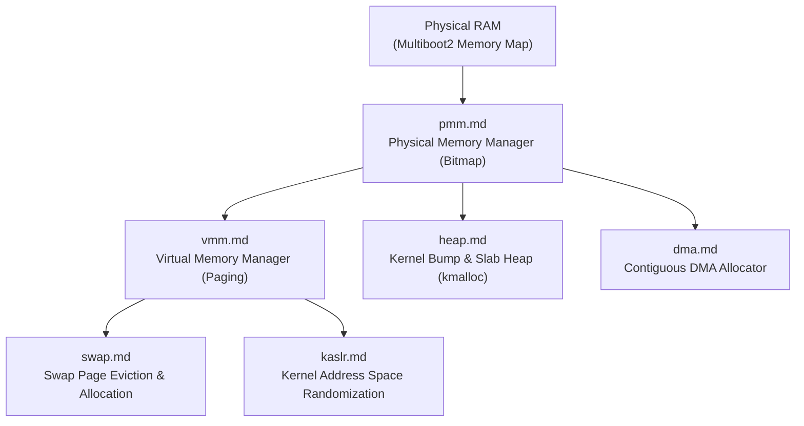

<!-- SPDX-License-Identifier: GPL-2.0-only -->

# Keira Kernel Memory Subsystems

The `memory` subsystem encompasses physical page frame allocation (PMM), 4-level virtual paging (VMM), kernel bump and slab heaps, Direct Memory Access (DMA) buffers, swap paging, and Kernel Address Space Layout Randomization (KASLR).

---

## Memory Subsystem Architecture

---

## Memory Module Index

| Document | Component | Description |
| :--- | :--- | :--- |
| [`pmm.md`](pmm.md) | Physical Frame Allocator | 4KB physical frame bitmapped tracking, usable RAM detection, and watermark metrics |
| [`vmm.md`](vmm.md) | Virtual Memory Manager | 4-level paging (PML4, PDPT, PD, PT), 32-bit two-level paging, and page table walks |
| [`heap.md`](heap.md) | Kernel Heap Allocator | 16-byte aligned bump allocator and slab allocator with `kmalloc` / `kfree` |
| [`dma.md`](dma.md) | DMA Buffer Subsystem | Physically contiguous buffers for PCI bus master devices (AHCI, e1000, NVMe) |
| [`swap.md`](swap.md) | Swap Paging Engine | Swap partition backing store and least-recently-used page frame eviction |
| [`kaslr.md`](kaslr.md) | Address Randomization | Random kernel base address offset generation using hardware RDRAND / TSC |
