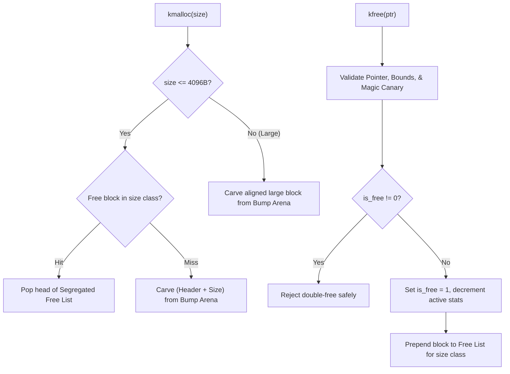

<!-- SPDX-License-Identifier: GPL-2.0-only -->

# Kernel Heap and Object Cache Allocator (`kmalloc`, `kfree`, `kmem_cache`)

This document details the segregated free-list heap allocator and `kmem_cache` object cache used for dynamic runtime kernel memory management in Keira Kernel.

---

## Architecture Overview

Keira Kernel implements a two-tier memory allocation subsystem:
1. **Segregated Free-List Heap Allocator (`crates/mem/src/heap/mod.rs`)**: Provides general-purpose dynamic memory allocation with active reclamation across 9 power-of-two size classes (16B through 4096B), canary validation, and double-free prevention.
2. **Kernel Object Cache (`crates/mem/src/slab/mod.rs`)**: A slab-like descriptor caching layer (`kmem_cache`) tailored for frequent, fixed-size kernel structures (`task_struct`, `inode`, `file_descriptor`, `vma_cache`).



---

## Segregated Free-List Specifications

* **Alignment**: Guaranteed 16-byte alignment (`#[repr(C, align(16))]`) on all allocations and headers across 32-bit and 64-bit architectures.
* **Header Canary**: Magic word `0x4B454952` (`KEIR` in ASCII little-endian) preceding every payload.
* **Double-Free Mitigation**: Header tracks `is_free` status flag. Any redundant deallocation attempt is rejected without memory corruption.
* **Size Classes**:
  * Class 0: 16 bytes
  * Class 1: 32 bytes
  * Class 2: 64 bytes
  * Class 3: 128 bytes
  * Class 4: 256 bytes
  * Class 5: 512 bytes
  * Class 6: 1024 bytes
  * Class 7: 2048 bytes
  * Class 8: 4096 bytes
  * Large: Allocations greater than 4096 bytes are allocated directly with `size_class = 0xFFFF`.

---

## Block Header Layout

```rust
#[repr(C, align(16))]
pub struct BlockHeader {
    pub magic: u32,                  // 0x4B454952 ("KEIR")
    pub size_class: u16,             // 0..8 or 0xFFFF (Large)
    pub is_free: u16,                // 0 = allocated, 1 = freed
    pub size: usize,                 // requested or allocated payload size
    pub next_free: *mut BlockHeader, // free list link pointer
}
```

---

## Core Heap API (`crates/mem/src/heap/mod.rs`)

```rust
/// Initialize the kernel heap allocator with a starting memory buffer.
#[no_mangle]
pub extern "C" fn heap_init(start: *mut u8, size: usize);

/// Allocate a block of kernel memory with 16-byte alignment.
#[no_mangle]
pub extern "C" fn kmalloc(size: usize) -> *mut u8;

/// Free a previously allocated memory block and return it to its size class.
#[no_mangle]
pub extern "C" fn kfree(ptr: *mut u8);

/// Query active and total heap telemetry.
pub fn heap_get_used() -> usize;
pub fn heap_get_free() -> usize;
pub fn heap_get_total() -> usize;
pub fn heap_get_peak() -> usize;
pub fn heap_get_alloc_count() -> usize;
pub fn heap_get_active_alloc_count() -> usize;
pub fn heap_get_arena_used() -> usize;
```

---

## Kernel Object Cache API (`crates/mem/src/slab/mod.rs`)

`KmemCache` manages pools of fixed-size structures without repeated heap fragmentation.

```rust
pub struct KmemCache {
    name: &'static str,
    obj_size: usize,
    align: usize,
    // ... internal free list and spinlock state
}

impl KmemCache {
    pub const fn new(name: &'static str, obj_size: usize, align: usize) -> Self;
    pub fn alloc(&self) -> *mut u8;
    pub fn free(&self, ptr: *mut u8);
    pub fn reap(&self);
    pub fn allocated_count(&self) -> usize;
    pub fn total_count(&self) -> usize;
    pub fn free_count(&self) -> usize;
}

// Built-in kernel descriptor caches
pub static TASK_CACHE: KmemCache;
pub static INODE_CACHE: KmemCache;
pub static FD_CACHE: KmemCache;
pub static VMA_CACHE: KmemCache;
```
