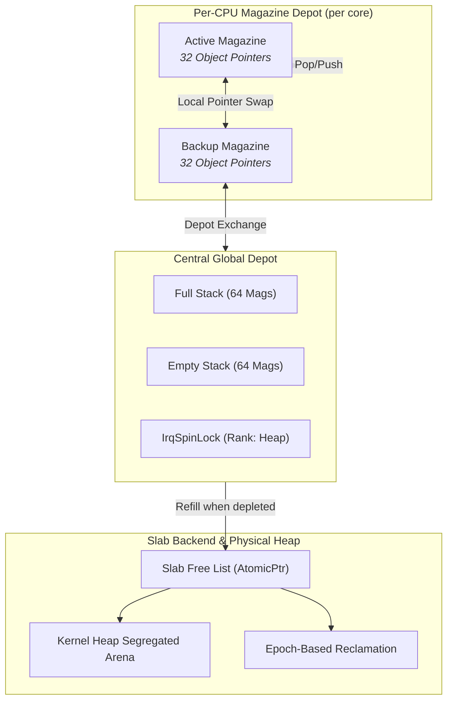

<!-- SPDX-License-Identifier: GPL-2.0-only -->

# Hierarchical Per-CPU Magazine-Style Slab Allocator

The Keira Kernel Slab subsystem (`crates/mem/src/slab/`) provides a high-performance, low-latency object caching allocator for fixed-size kernel descriptors (`task_struct`, `vfs_inode`, `file_desc`, `vma_area`). Based on Jeff Bonwick's magazine-layer caching architecture and integrated with compile-time Epoch-Based Reclamation (EBR), it eliminates lock contention across symmetric multiprocessing (SMP) CPU cores, enabling $O(1)$ zero-lock, zero-atomic allocations and deallocations.

---

## 1. Architectural Overview



---

## 2. Core Architectural Layers

### A. Jeff Bonwick's Magazine Container (`crates/mem/src/slab/magazine/mod.rs`)
A `Magazine` represents a contiguous array of pre-allocated raw object pointers:
```rust
pub const MAGAZINE_CAPACITY: usize = 32;

pub struct Magazine {
    pub objects: [*mut u8; MAGAZINE_CAPACITY],
    pub rounds: usize,
}
```
* **LIFO Discipline**: Pushing and popping pointers operates in Last-In First-Out order. The most recently deallocated object is the first to be reallocated, maximizing L1 data cache warmth.
* **$O(1)$ Complexity**: A single array index modification without atomic CAS or memory bus barriers.

### B. Per-CPU Depot (`crates/mem/src/slab/magazine/percpu.rs`)
Each processor core manages private `active` and `backup` magazines:
```rust
pub struct CpuDepot {
    active: Magazine,
    backup: Magazine,
    alloc_hits: AtomicUsize,
    free_hits: AtomicUsize,
    exchanges: AtomicUsize,
}
```
* **Fast-Path Allocation**:
  1. Pop from local `active` magazine ($O(1)$, zero locks).
  2. If `active` is empty and `backup` is non-empty, swap pointers locally.
  3. If both are empty, exchange `backup` with the Central Global Depot.
  4. If the depot is depleted, refill the active magazine from the slab backend.
* **Fast-Path Deallocation**:
  1. Push pointer into local `active` magazine ($O(1)$, zero locks).
  2. If `active` is full and `backup` is non-full, swap pointers locally.
  3. If both are full, exchange `backup` with the Central Global Depot.
* **Transparent Cross-CPU Deallocation**: If Core $A$ frees an object originally allocated by Core $B$, Core $A$ pushes the object directly into its own local active magazine. No remote inter-processor interrupts (IPIs) or remote spinlocks are required.

### C. Central Global Depot (`crates/mem/src/slab/magazine/depot.rs`)
The `GlobalDepot` mediates magazine exchanges between CPU cores:
```rust
pub const DEPOT_CAPACITY: usize = 64;

pub struct GlobalDepot {
    full_stack: [Option<Magazine>; DEPOT_CAPACITY],
    full_count: usize,
    empty_stack: [Option<Magazine>; DEPOT_CAPACITY],
    empty_count: usize,
    lock: IrqSpinLock,
}
```
* **Amortized Lock Contention**: The central depot lock is acquired only once every 32 allocations or deallocations, reducing SMP lock contention by 32x.
* **EBR Protection**: All depot exchanges are executed within an active epoch pin (`keira_core::sync::ebr::pin()`).

### D. Hierarchical Cache Manager (`crates/mem/src/slab/cache/manager.rs`)
The `KmemCache` orchestrates per-CPU depots, global depot pools, and heap refills:
```rust
pub struct KmemCache {
    name: &'static str,
    obj_size: usize,
    align: usize,
    cpu_depots: [CpuDepot; MAX_CPU_CORES],
    cpu_locks: [IrqSpinLock; MAX_CPU_CORES],
    global_depot: GlobalDepot,
    slab_lock: IrqSpinLock,
    slab_free_list: AtomicPtr<u8>,
    allocated_count: AtomicUsize,
    total_count: AtomicUsize,
}
```

---

## 3. Pre-Allocated Static Kernel Caches

Keira instantiates four primary static caches for critical kernel data structures:

| Cache Constant | Descriptor Type | Object Size | Alignment | Purpose |
| :--- | :--- | :--- | :--- | :--- |
| `TASK_CACHE` | `task_struct` | 512 bytes | 16 bytes | Process Control Blocks, context registers, credentials |
| `INODE_CACHE` | `vfs_inode` | 256 bytes | 16 bytes | Filesystem metadata, block extent mappings |
| `FD_CACHE` | `file_desc` | 64 bytes | 16 bytes | Process file descriptor table entries |
| `VMA_CACHE` | `vma_area` | 128 bytes | 16 bytes | Virtual memory area ranges and protection flags |

---

## 4. Cache Reaping & Reclamation

When the physical memory manager detects memory pressure, it invokes `reap()`:
1. **CPU Depot Flush**: Drains `active` and `backup` magazines across all SMP cores.
2. **Central Depot Drain**: Drains all buffered full magazines from `GlobalDepot`.
3. **Slab Free List Reclamation**: Returns pre-carved objects back to the kernel heap via `kfree`.
4. **Counter Balancing**: Decrements `total_count` to ensure exact memory accounting.

---

## 5. C ABI Compatibility

For interoperation with userland utilities and C subsystems, `KmemCache` exposes standard C functions:
* `kmem_cache_create(name, obj_size, align) -> KmemCache`
* `kmem_cache_alloc(cache: *const KmemCache) -> *mut u8`
* `kmem_cache_free(cache: *const KmemCache, ptr: *mut u8)`
