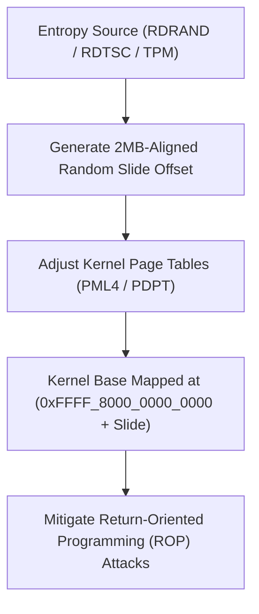

<!-- SPDX-License-Identifier: GPL-2.0-only -->

# Kernel Address Space Layout Randomization (KASLR)

This document specifies Kernel Address Space Layout Randomization (KASLR), entropy generation, and slide offset calculation in Keira Kernel.

---

## KASLR Memory Virtualization Architecture



---

## Technical Specifications

| Parameter | Specification | Description |
| :--- | :--- | :--- |
| **Entropy Sources** | `RDRAND` instruction, CPU `RDTSC`, TPM 2.0 TRNG | Cryptographically sound entropy pooling |
| **Alignment** | 2 Megabyte Alignment | Aligns with Huge Page virtual mapping boundaries |
| **Virtual Base Space** | `0xFFFF_8000_0000_0000` to `0xFFFF_8000_4000_0000` | 1 GB randomized kernel execution region |

---

## Core API (`crates/mem/src/kaslr/mod.rs`)

```rust
/// Generate random KASLR slide offset during early boot.
pub unsafe fn calculate_kaslr_slide() -> usize;

/// Apply randomized virtual memory offset to kernel master page tables.
pub unsafe fn apply_kaslr_offset(slide: usize);
```
