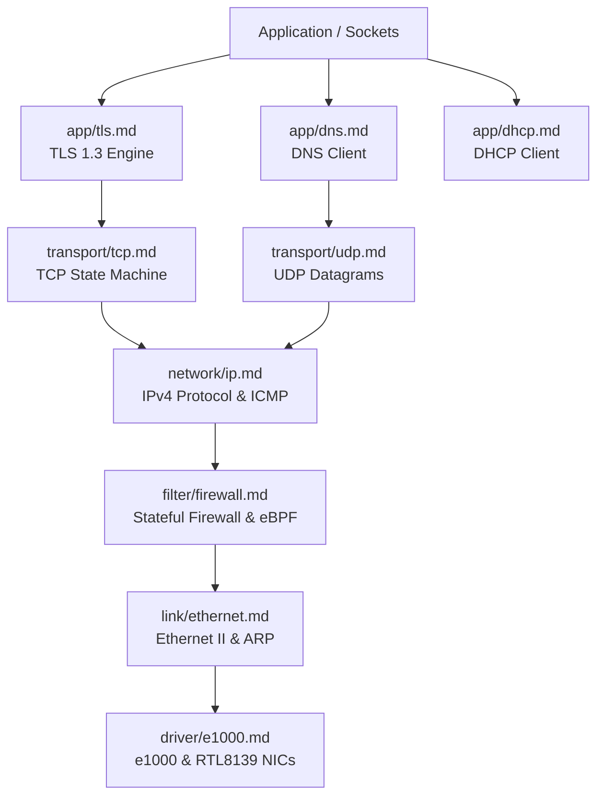

<!-- SPDX-License-Identifier: GPL-2.0-only -->

# Keira Layered Bare-Metal Network Stack

The `net` domain provides a self-contained bare-metal network stack spanning Layer 2 Ethernet through Layer 7 TLS 1.3 and firewall filtering.

---

## Network Stack Architecture

---

## Submodule Index

| Submodule | Focus Area | Description |
| :--- | :--- | :--- |
| [`link/`](link/README.md) | Data Link Layer | Ethernet II framing and ARP cache resolution |
| [`network/`](network/README.md) | Network Layer | IPv4 packet handling, routing, and ICMP echo |
| [`transport/`](transport/README.md) | Transport Layer | UDP datagrams and stateful TCP connection engine |
| [`app/`](app/README.md) | Application Layer | DHCP network auto-config, DNS resolver, and native TLS 1.3 |
| [`socket/`](socket/README.md) | Socket Layer | BSD socket descriptor table, handle abstraction |
| [`driver/`](driver/README.md) | Network Drivers | Intel e1000, Realtek RTL8139, and VirtIO-Net drivers |
| [`filter/`](filter/README.md) | Packet Filtering | Stateful packet inspection firewall and in-kernel eBPF |
