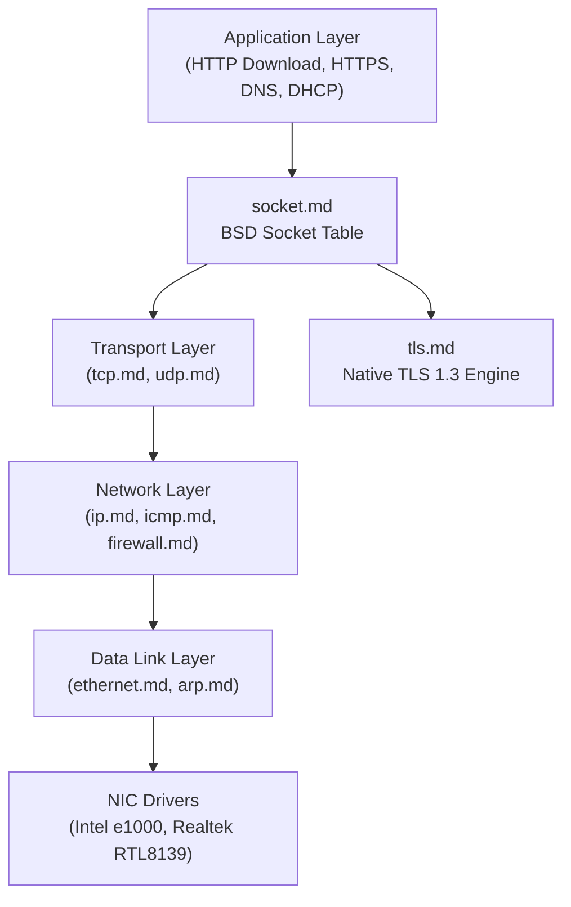

<!-- SPDX-License-Identifier: GPL-2.0-only -->

# Keira Kernel Layered Bare-Metal TCP/IP Protocol Stack

The `net` subsystem implements a complete, zero-dependency TCP/IP stack from raw Ethernet frame parsing to socket abstraction, native TLS 1.3, and stateful packet filtering.

---

## Network Stack Protocol Hierarchy

---

## Network Protocol Index

| Layer | Protocol | Document | Description |
| :--- | :--- | :--- | :--- |
| **Layer 2** | Ethernet | [`ethernet.md`](ethernet.md) | IEEE 802.3 framing, EtherType dispatching, and MAC parsing |
| **Layer 2.5** | ARP | [`arp.md`](arp.md) | Address Resolution Protocol table cache and query broadcast |
| **Layer 3** | IPv4 | [`ip.md`](ip.md) | IPv4 packet routing, fragment reassembly, and header checksums |
| **Layer 3** | ICMP | [`icmp.md`](icmp.md) | Internet Control Message Protocol Echo Request/Reply (Ping) |
| **Layer 4** | UDP | [`udp.md`](udp.md) | Stateless User Datagram Protocol packet processing |
| **Layer 4** | TCP | [`tcp.md`](tcp.md) | Stateful TCP 3-way handshake, retransmission timers, and windowing |
| **Layer 7** | DHCP | [`dhcp.md`](dhcp.md) | Dynamic Host Configuration Protocol auto-configuration client |
| **Layer 7** | DNS | [`dns.md`](dns.md) | Domain Name System resolver over UDP port 53 |
| **Security** | TLS 1.3 | [`tls.md`](tls.md) | Bare-metal Transport Layer Security 1.3 with AES-128-GCM |
| **Security** | Firewall | [`firewall.md`](firewall.md) | Stateful Netfilter packet filter and iptables rules |
| **API** | Sockets | [`socket.md`](socket.md) | POSIX BSD socket descriptor table and API |
