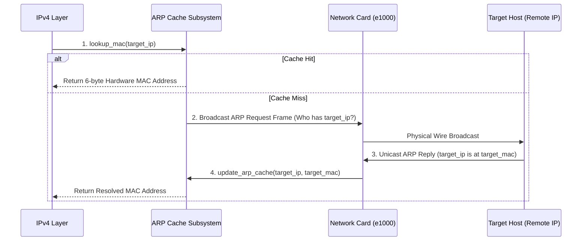

<!-- SPDX-License-Identifier: GPL-2.0-only -->

# Address Resolution Protocol (ARP) Subsystem

This document specifies the Address Resolution Protocol (ARP), dynamic MAC address discovery, and 16-slot LRU ARP caching in Keira Kernel.

---

## ARP Resolution Flow



---

## Technical Specifications

| Parameter | Specification | Description |
| :--- | :--- | :--- |
| **Hardware Type** | `0x0001` | Ethernet (10/100/1000 Mbps) |
| **Protocol Type** | `0x0800` | IPv4 Address Resolution |
| **Cache Capacity** | 16 LRU Table Slots | Automatic hit tracking and dynamic entry expiration |
| **Gratuitous ARP** | Supported | Broadcasts announcement upon network initialization |

---

## Core API (`crates/net/src/arp/table.rs`)

```rust
/// Look up hardware MAC address for a given IPv4 destination.
pub unsafe fn lookup_mac(ip: [u8; 4]) -> Option<[u8; 6]>;

/// Update dynamic ARP cache with newly received IP-to-MAC mapping.
pub unsafe fn update_arp_cache(ip: [u8; 4], mac: [u8; 6]);

/// Send Gratuitous ARP announcement to notify local network segment.
pub unsafe fn send_arp_announcement() -> Result<(), &'static str>;
```
