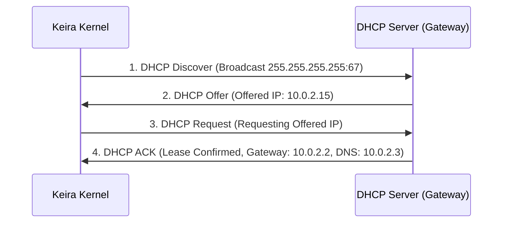

<!-- SPDX-License-Identifier: GPL-2.0-only -->

# Dynamic Host Configuration Protocol (DHCP)

This document details the DHCP client auto-configuration engine in Keira Kernel.

---

## 4-Step DHCP DORA Exchange



---

## Core API (`crates/net/src/dhcp.rs`)

```rust
pub fn dhcp_auto_configure(mac: &MacAddress) -> Result<DhcpConfig, &'static str>;
```
