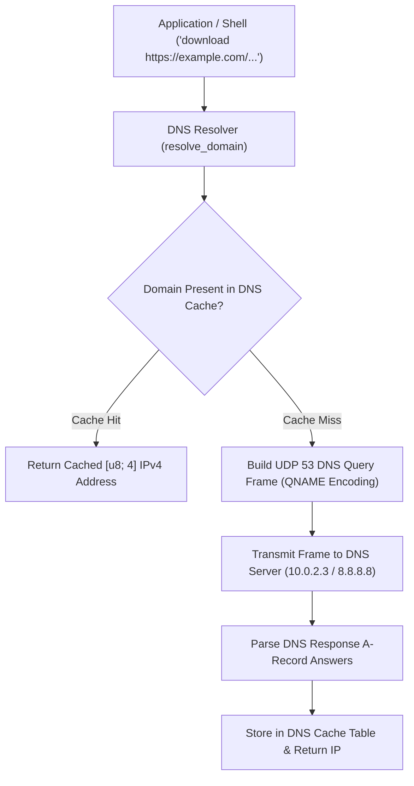

<!-- SPDX-License-Identifier: GPL-2.0-only -->

# Domain Name System (DNS) Resolver & Cache

This document specifies the UDP Port 53 Domain Name System (DNS) query engine, QNAME encoding, and 16-slot LRU DNS cache in Keira Kernel.

---

## DNS Resolution Pipeline



---

## Technical Specifications

| Parameter | Specification | Description |
| :--- | :--- | :--- |
| **Transport Protocol** | UDP over IPv4 (Port 53) | Low-overhead connectionless queries |
| **Query Type** | Type A (Host Address) | Standard 32-bit IPv4 record requests |
| **Cache Capacity** | 16 LRU Slots | Domain name, IP address, hit counter, and validity |
| **Encoding** | DNS QNAME Format | Length-prefixed dot notation (`\x06google\x03com\x00`) |

---

## Core API (`crates/net/src/dns/resolver.rs`)

```rust
/// Resolve domain string to 4-byte IPv4 address via cache lookup or UDP query.
pub unsafe fn resolve_domain(domain: &str) -> Result<[u8; 4], &'static str>;

/// Print active DNS cache entries and hit metrics to console.
pub unsafe fn print_dns_cache();
```
