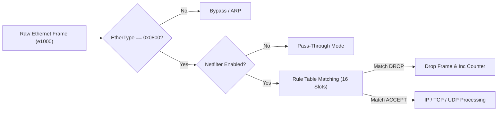

<!-- SPDX-License-Identifier: GPL-2.0-only -->

# Netfilter Stateful Packet Filter & Firewall

This document specifies the in-kernel IPv4 packet filtering rules engine, connection tracking (CONNTRACK), and Intel e1000 driver integration in Keira Kernel.

---

## 1. Architecture & Pipeline



The firewall is integrated directly into the Intel e1000 NIC packet reception loop (`receive_raw_frame` in `crates/net/src/driver/e1000.rs`), providing low-overhead ingress packet inspection before higher-layer processing.

---

## 2. Dynamic Rule Architecture

Firewall rules and connection tracking entries are maintained in fixed-size bare-metal tables without dynamic heap allocations:

* **Rule Table**: `RULE_TABLE: [FirewallRule; 16]` supporting matches on Chain (`INPUT`, `OUTPUT`, `FORWARD`), Protocol (`TCP`, `UDP`, `ICMP`, `ANY`), Destination Port, and Action (`ACCEPT`, `DROP`, `REJECT`).
* **Connection Tracking**: `CONNTRACK_TABLE: [ConnTrackEntry; 16]` maintaining state (`NEW`, `ESTABLISHED`, `RELATED`), destination port, and packet counters.
* **Telemetry**: Live global atomic counters tracking `PACKETS_INSPECTED` and `PACKETS_DROPPED`.

---

## 3. Core API (`crates/net/src/filter/firewall.rs`)

```rust
/// Append a firewall rule dynamically to the table.
pub fn add_rule(
    chain: &str,
    proto: &str,
    dport: u16,
    action: &str,
    src_ip: &str,
    dst_ip: &str,
) -> Result<usize, &'static str>;

/// Delete a firewall rule by 1-indexed number.
pub fn delete_rule(index: usize) -> Result<(), &'static str>;

/// Flush all firewall rules and connection tracking entries.
pub fn flush_rules();

/// Filter raw Ethernet IPv4 frame.
/// Returns true if packet is ACCEPT, false if DROP.
pub unsafe fn filter_ipv4_frame(frame: &[u8]) -> bool;

/// Print formatted firewall status and active rules.
pub unsafe fn print_firewall_status();

/// Netfilter firewall syscall dispatcher (Syscall 76).
pub unsafe fn sys_netfilter(cmd: u32, arg1: u64, arg2: u64) -> Result<u64, &'static str>;
```

---

## 4. Shell Integration

Firewall status and rules are administered via two native shell commands:

* **`firewall`**: Toggle state (`firewall enable`, `firewall disable`, `firewall toggle`), display telemetry status (`firewall status`), or reset tables (`firewall flush`).
* **`iptables`**: Standard POSIX/GNU rule management:
  - List rules: `iptables -L`
  - Append rule: `iptables -A INPUT -p tcp --dport 8080 -j DROP`
  - Delete rule: `iptables -D <rule_number>`
  - Flush rules: `iptables -F`

---

## 5. In-Kernel eBPF Packet Filter Engine (`crates/net/src/filter/bpf.rs`)

Keira integrates an in-kernel eBPF virtual machine, bytecode verifier, and map runtime:

* **In-Kernel Verifier (`bpf_verify`)**: Enforces bounded-cycle CFG analysis, valid jump offsets within instruction slices, division-by-zero checks, and guaranteed program termination with `BPF_RET`.
* **VM Interpreter (`bpf_run_filter`)**: Evaluates instructions directly against raw packet buffers with 32-bit registers `A`, `X`, and 16-word scratch memory.
* **In-Kernel Maps**: Supports 8 hash and array maps for dynamic telemetry, blacklist counters, and key-value state tracking.
* **Syscall Interface**: Syscall 78 (`SYS_BPF`) for map create, lookup, update, and program telemetry.
* **Shell Command**: Administered via the native `bpf` command (`bpf status`, `bpf list`, `bpf maps`, `bpf test`, `bpf map-get`, `bpf map-set`).
