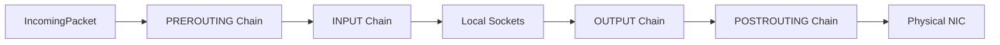

<!-- SPDX-License-Identifier: GPL-2.0-only -->

# Netfilter Stateful Packet Filter & Firewall

This document specifies the in-kernel packet filtering rules engine and connection tracking in Keira Kernel.

---

## Filter Chains



---

## Core API (`crates/net/src/firewall.rs`)

```rust
pub fn firewall_evaluate_packet(packet: &[u8], is_ingress: bool) -> FirewallAction;
pub fn firewall_add_rule(rule: FirewallRule) -> Result<(), &'static str>;
pub fn firewall_flush();
```
