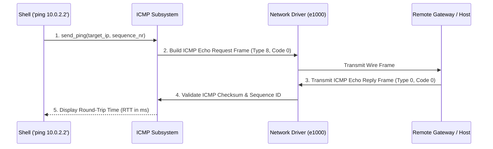

<!-- SPDX-License-Identifier: GPL-2.0-only -->

# Internet Control Message Protocol (ICMP / Ping)

This document specifies the Internet Control Message Protocol (ICMP), Echo Request / Echo Reply packet handling, checksum validation, and the `ping` utility in Keira Kernel.

---

## ICMP Echo Request & Reply Flow



---

## Technical Specifications

| Parameter | Specification | Description |
| :--- | :--- | :--- |
| **IP Protocol Number** | `1` (`IPPROTO_ICMP`) | Assigned IPv4 transport protocol |
| **Message Types** | Type 8 (Echo Request), Type 0 (Echo Reply) | Standard network diagnostics |
| **Checksum** | 16-bit One's Complement | RFC 1071 standard checksum calculation |

---

## Core API (`crates/net/src/icmp/ping.rs`)

```rust
/// Send ICMP Echo Request packet to remote IP and wait for Echo Reply.
pub unsafe fn send_ping(target_ip: [u8; 4], timeout_ms: u64) -> Result<u64, &'static str>;
```

---

## Shell Usage

```bash
# Ping the default gateway to verify network connectivity
keira> ping 10.0.2.2
```
