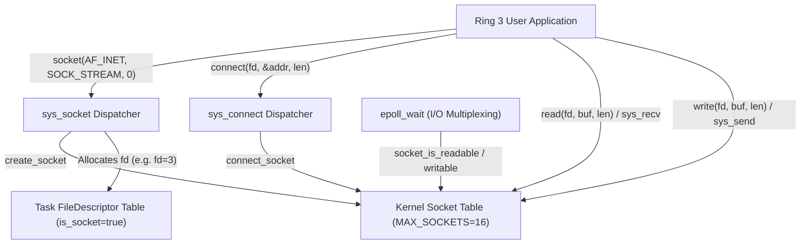
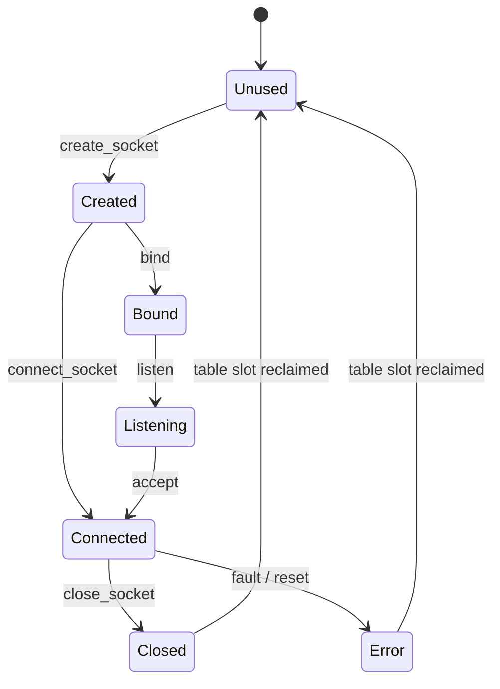

<!-- SPDX-License-Identifier: GPL-2.0-only -->

# BSD Socket API & In-Kernel Socket Table

This document specifies the in-kernel socket table architecture, state machine, and POSIX-compatible socket interfaces in Keira Kernel.

---

## 1. Architectural Overview



---

## 2. In-Kernel Socket Table (`SOCKET_TABLE`)

Sockets are managed in an austere, fixed-size global descriptor table (`crates/net/src/socket/sock.rs`):

| Parameter | Value | Description |
| :--- | :--- | :--- |
| `MAX_SOCKETS` | `16` | Maximum concurrent active sockets system-wide |
| `SOCKET_BUF_SIZE` | `2048` bytes | Fixed-size ring buffer for socket RX and TX streams |
| `Default State` | `SocketState::Unused` | Initial state of unallocated table slots |

---

## 3. Socket State Machine



| State | Description |
| :--- | :--- |
| `Unused` | Descriptor slot is idle and available for allocation |
| `Created` | Endpoint allocated via `create_socket`, not yet bound or connected |
| `Bound` | Bound to a local port address |
| `Listening` | Passive listening socket awaiting incoming connections |
| `Connected` | Active bidirectional transmission channel established |
| `Closed` | Teardown sequence initiated or completed |
| `Error` | Channel faulted or connection reset |

---

## 4. Supported Domains and Types

| Constant | Value | Description |
| :--- | :--- | :--- |
| `AF_INET` | `2` | IPv4 Internet protocol family |
| `SOCK_STREAM` | `1` | Connection-oriented, reliable stream (TCP) |
| `SOCK_DGRAM` | `2` | Connectionless datagram service (UDP) |
| `SOCK_RAW` | `3` | Direct raw packet transmission interface |

---

## 5. Core Kernel API (`crates/net/src/socket/sock.rs`)

```rust
/// Allocate and initialize a new socket in the kernel socket table.
pub fn create_socket(domain: i32, sock_type: i32, protocol: i32) -> Result<u32, &'static str>;

/// Connect a socket to a remote IPv4 endpoint.
pub fn connect_socket(id: u32, remote_ip: [u8; 4], remote_port: u16) -> Result<(), &'static str>;

/// Transmit bytes across an active socket channel.
pub fn send_socket(id: u32, buf: &[u8]) -> Result<usize, &'static str>;

/// Receive bytes from a socket channel into a destination buffer.
pub fn recv_socket(id: u32, buf: &mut [u8]) -> Result<usize, &'static str>;

/// Close and release an active socket descriptor.
pub fn close_socket(id: u32) -> Result<(), &'static str>;

/// Query whether unconsumed bytes or connection termination state are pending.
pub fn socket_is_readable(id: u32) -> bool;

/// Query whether the socket is connected and capable of accepting outbound bytes.
pub fn socket_is_writable(id: u32) -> bool;

/// Configure non-blocking operation on the designated socket.
pub fn set_socket_nonblocking(id: u32, nonblocking: bool) -> Result<(), &'static str>;
```

---

## 6. Process File Descriptor & Epoll Integration

1. **Unified File Descriptor Multiplexing**:
   - Calling `SYS_SOCKET` (Vector `24`) finds an unused file descriptor in `task.fds` (starting at `3`), marks `is_socket = true`, records `socket_id`, and returns the process-relative `fd`.
   - Standard POSIX system calls (`read`, `write`, `close`) inspect `task.fds[fd].is_socket` and transparently route operations directly to `recv_socket`, `send_socket`, or `close_socket`.
2. **Epoll Readiness Monitoring**:
   - Monitored socket descriptors automatically report readiness to `epoll_wait` through `socket_is_readable` (`EPOLLIN`) and `socket_is_writable` (`EPOLLOUT`).
