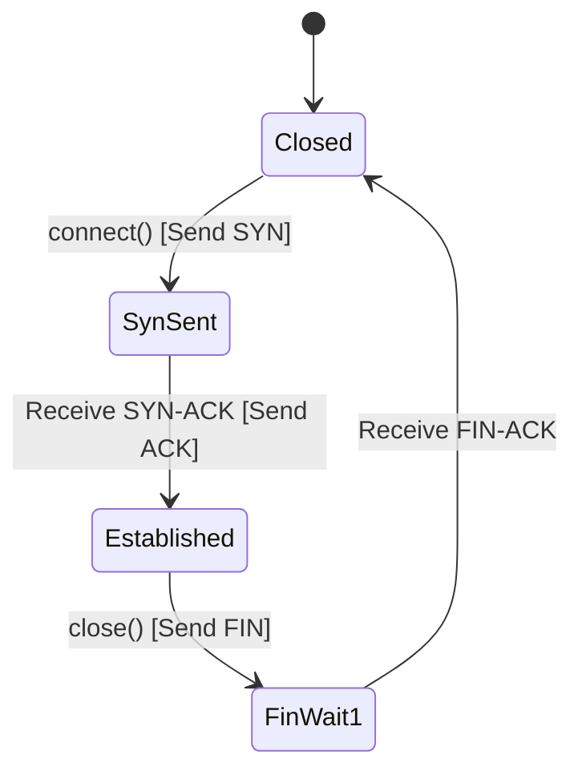

<!-- SPDX-License-Identifier: GPL-2.0-only -->

# Transmission Control Protocol (TCP)

This document specifies the stateful TCP connection state machine, sliding window flow control, and retransmission engine in Keira Kernel.

---

## TCP Connection State Machine



---

## Monotonic Ephemeral Port Allocator

To prevent port reuse collisions in rapid sequential connections (e.g. within QEMU SLIRP), source ports are allocated atomically from a monotonic pool:

```rust
static NEXT_SRC_PORT: AtomicU16 = AtomicU16::new(49152);

pub fn get_next_src_port() -> u16 {
    let port = NEXT_SRC_PORT.fetch_add(1, Ordering::Relaxed);
    if port >= 65000 {
        NEXT_SRC_PORT.store(49152, Ordering::Relaxed);
    }
    port
}
```

---

## Core API (`crates/net/src/tcp/mod.rs`)

```rust
pub fn tcp_connect(dst_ip: Ipv4Address, dst_port: u16) -> Result<TcpStream, &'static str>;
pub fn tcp_send(stream: &mut TcpStream, data: &[u8]) -> Result<usize, &'static str>;
pub fn tcp_recv(stream: &mut TcpStream, buf: &mut [u8]) -> Result<usize, &'static str>;
pub fn tcp_close(stream: TcpStream);
```
