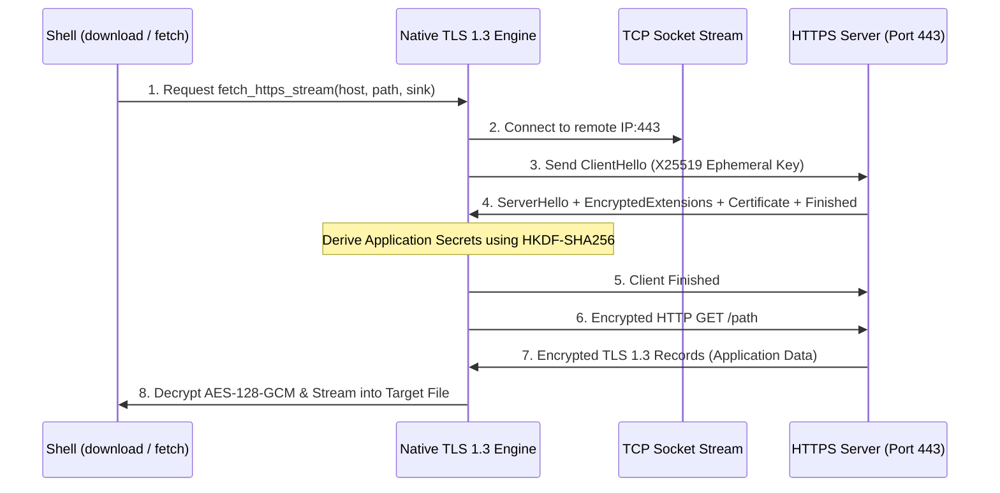

<!-- SPDX-License-Identifier: GPL-2.0-only -->

# Native Transport Layer Security (TLS 1.3) Engine

This document specifies the bare-metal TLS 1.3 cryptographic handshaking, record encryption, and streaming download pipeline in Keira Kernel.

---

## Cryptographic Architecture



---

## Supported Cryptographic Suites

| Tier | Protocol / Algorithm | Implementation |
| :--- | :--- | :--- |
| **Key Exchange** | X25519 ECDHE | Pure Rust Curve25519 scalar multiplication (`crates/crypto/src/curve25519/`) |
| **Symmetric Cipher** | AES-128-GCM | Authenticated Encryption with Associated Data (AEAD) (`crates/crypto/src/aes/`) |
| **Key Derivation** | HKDF-SHA256 | HMAC-based Extract-and-Expand Key Derivation (`crates/crypto/src/sha256/`) |
| **Record Framing** | TLS 1.3 Standard | 5-byte TLS record headers (`ContentType`, `LegacyVersion`, `Length`) |

---

## Core API (`crates/net/src/tls/mod.rs`)

```rust
/// Connect to a remote HTTPS host, perform TLS 1.3 handshake, and return active stream.
pub fn tls_connect(host: &str, ip: Ipv4Address, port: u16) -> Result<TlsStream, &'static str>;

/// Stream a remote HTTPS resource directly into a file on FAT16 disk storage.
pub fn fetch_https_stream(
    host: &str,
    path: &str,
    target_path: &str,
    progress_callback: fn(usize, usize),
) -> Result<usize, &'static str>;
```
