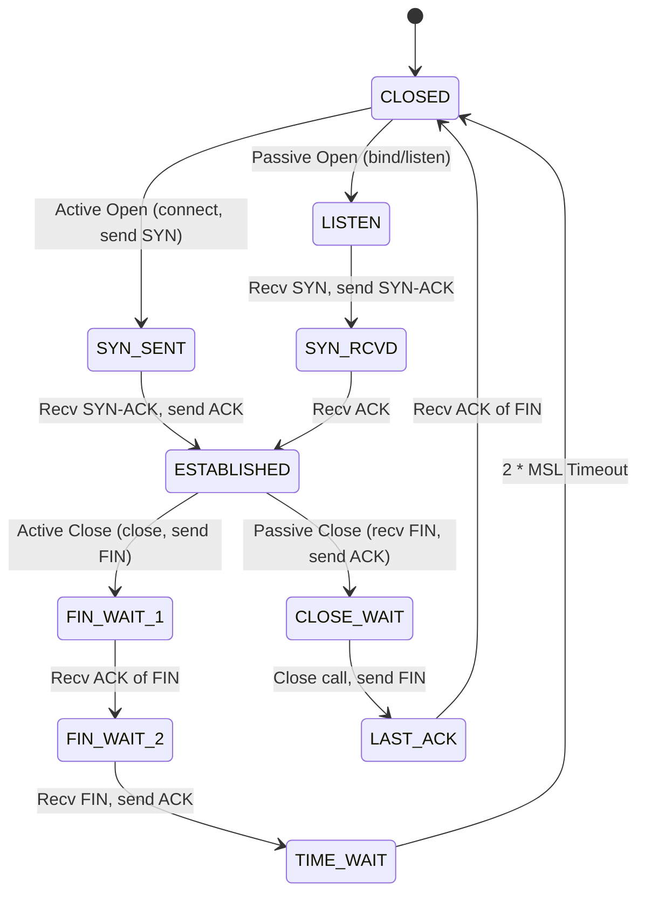

<!-- SPDX-License-Identifier: GPL-2.0-only -->

# Transmission Control Protocol (TCP) State Machine

Keira implements a stateful, RFC 793 compliant TCP protocol engine (`crates/net/src/tcp/`) supporting reliable, ordered stream communication.

---

## 1. TCP Connection State Machine

---

## 2. Sliding Window & Flow Control

* **Sequence Tracking**: Every connection tracks `snd_una` (unacknowledged send), `snd_nxt` (next send sequence), and `rcv_nxt` (expected receive sequence).
* **Receive Window (`rcv_wnd`)**: Advertised in every TCP header to throttle remote transmitters according to available ring buffer space.
