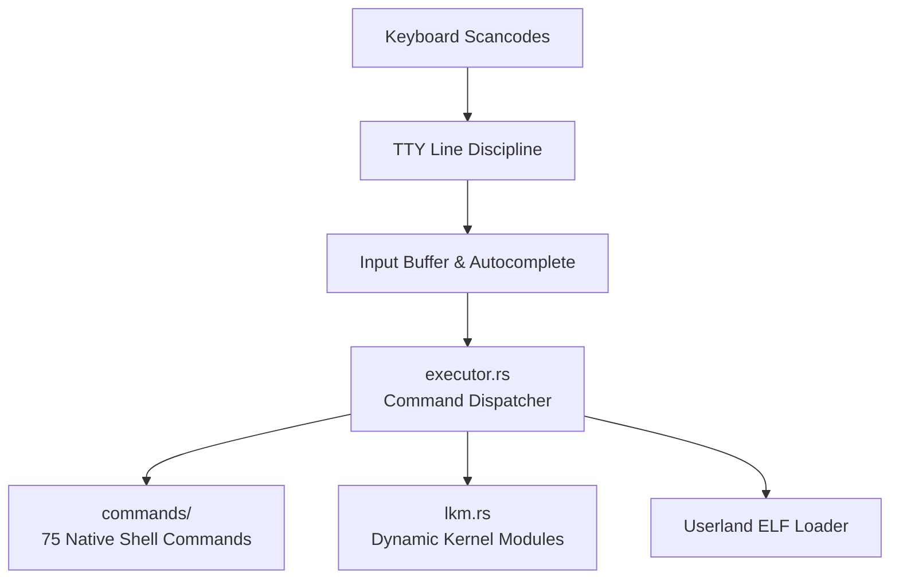

<!-- SPDX-License-Identifier: GPL-2.0-only -->

# Keira Kernel Interactive Shell Subsystem

The `shell` subsystem provides an interactive command line interface, command executor, line editor (`kvi`), tab auto-completion engine, history ring buffer, service supervisor, and 75 native utilities.

---

## Architecture Pipeline

---

## Submodule Index

| Module | Focus Area | Description |
| :--- | :--- | :--- |
| [`executor.md`](executor.md) | Command Executor | String tokenization, variable expansion (`$PATH`, `$USER`), pipelines (`|`), and file redirection (`>`, `>>`) |
| [`editor.md`](editor.md) | `kvi` Text Editor | Fullscreen interactive text editor with file saving and cut/paste buffers |
| [`autocomplete.md`](autocomplete.md) | Auto-Completion | Dynamic file path, device node, and command name completion engine |
| [`history.md`](history.md) | History Buffer | Circular command history ring buffer with Up/Down arrow navigation |
| [`service.md`](service.md) | Service Supervisor | Background service supervisor managing persistent kernel daemons |
| [`commands/`](commands/README.md) | Native Commands Catalog | Hyper-modular catalog covering all 75 built-in shell utilities |
