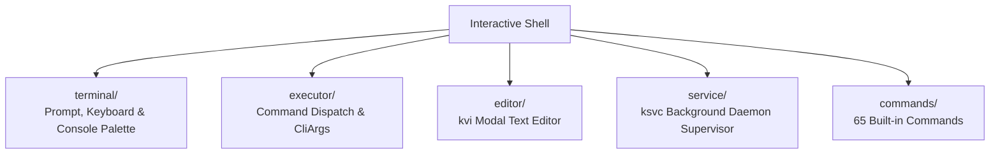

<!-- SPDX-License-Identifier: GPL-2.0-only -->

# Keira Interactive Shell & Command Subsystem

The `shell` domain provides the user-facing command-line interface, modal editor, daemon supervisor, and 65 built-in tools.

---

## Shell Architecture

---

## Submodule Index

| Submodule | Focus Area | Description |
| :--- | :--- | :--- |
| [`terminal/`](terminal/README.md) | Terminal UI | Prompt rendering, keyboard input, monochrome palette |
| [`executor/`](executor/README.md) | Command Execution | Argument parsing, pipe routing, execution dispatch |
| [`editor/`](editor/README.md) | Text Editor | `kvi` modal vim-like text editor with syntax highlighting |
| [`service/`](service/README.md) | Daemon Manager | `ksvc` background supervisor (`syslogd`, `syncd`, etc.) |
| [`commands/`](commands/README.md) | Built-in Commands | Reference manuals for all 65 built-in shell commands |
