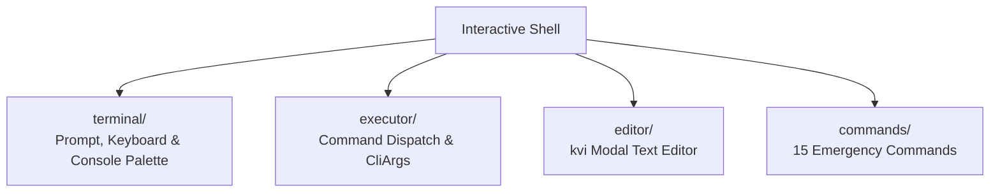

<!-- SPDX-License-Identifier: GPL-2.0-only -->

# Keira Interactive Shell & Command Subsystem

The `shell` domain provides the kernel emergency debugger control plane, modal text editor and 15 built-in diagnostic commands. Standard user utilities (`ps`, `kill`, `hostname`, `clear`, `dmesg`, `df`, `cat`, `ls`, `fetch`, `kcc`, `sh` and `init`) run exclusively in Ring 3 userspace (`/bin`).

---

## Shell Architecture

```mermaid
graph TD
    Shell["Interactive Shell"] --> Terminal["terminal/<br/>Prompt, Keyboard & Console Palette"]
    Shell --> Executor["executor/<br/>Command Dispatch & CliArgs"]
    Shell --> Editor["editor/<br/>kvi Modal Text Editor"]
    Shell --> Cmds["commands/<br/>15 Emergency Commands"]
```

---

## Submodule Index

| Submodule | Focus Area | Description |
| :--- | :--- | :--- |
| [`terminal/`](terminal/README.md) | Terminal UI | Prompt rendering, keyboard input, monochrome palette |
| [`executor/`](executor/README.md) | Command Execution | Argument parsing, pipe routing, execution dispatch |
| [`editor/`](editor/README.md) | Text Editor | `kvi` modal vim-like text editor with syntax highlighting |
| [`commands/`](commands/README.md) | Built-in Commands | Reference manuals for all 15 built-in emergency commands |
