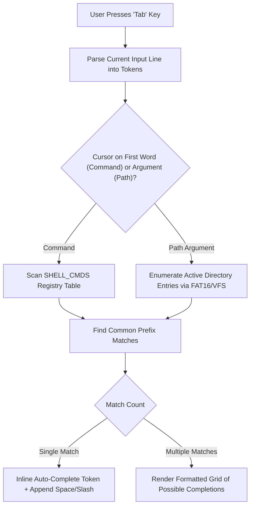

<!-- SPDX-License-Identifier: GPL-2.0-only -->

# Interactive Tab Autocompletion Engine

This document specifies the interactive command and file path autocompletion engine in `keira-shell`.

---

## Autocompletion Pipeline



---

## Technical Specifications

| Parameter | Specification | Description |
| :--- | :--- | :--- |
| **Trigger Key** | ASCII Tab (`0x09`) | Standard interactive trigger |
| **Match Domains** | Commands, Executables (`.elf`), File Paths, Directories | Context-aware suggestion scoping |
| **Directory Trailing** | Appends trailing slash `/` | Allows fluid traversal through subdirectories |

---

## Core API (`crates/shell/src/autocomplete.rs`)

```rust
/// Compute auto-completion suggestions for current command line buffer.
pub fn handle_tab_completion(line_buf: &mut [u8], len: &mut usize, cursor_pos: &mut usize);
```
