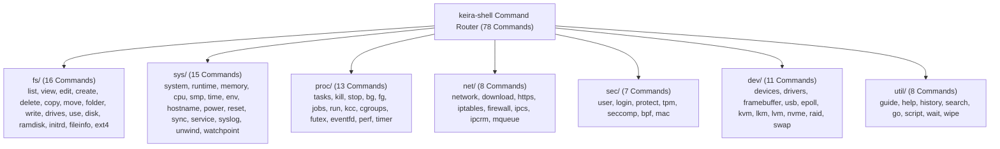

<!-- SPDX-License-Identifier: GPL-2.0-only -->

# Native Shell Built-In Commands

This directory documents the 78 native built-in commands organized by subsystem domain in Keira Kernel, categorized by **Active Bare-Metal Implementations** (66 commands) and **Interface Prototypes / Stubs** (12 commands).

---

## Command Domain Architecture

---

## Subsystem Domain Summary

| Domain | Path | Total Commands | Active | Preview | Documentation |
| :--- | :--- | :--- | :--- | :--- | :--- |
| **Hardware & Devices** | `dev/` | 11 | 5 | 6 | [dev.md](dev.md) |
| **Filesystem & Storage** | `fs/` | 16 | 15 | 1 | [fs.md](fs.md) |
| **Process & Scheduling** | `proc/` | 13 | 8 | 5 | [proc.md](proc.md) |
| **Networking & Sockets** | `net/` | 8 | 8 | 0 | [net.md](net.md) |
| **Security & Accounts** | `sec/` | 7 | 7 | 0 | [sec.md](sec.md) |
| **System & Telemetry** | `sys/` | 15 | 15 | 0 | [sys.md](sys.md) |
| **Utilities & Shell** | `util/` | 8 | 8 | 0 | [util.md](util.md) |
| **Total** | | **78** | **66** | **12** | |
