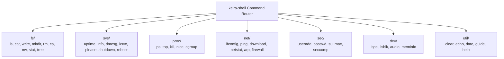

<!-- SPDX-License-Identifier: GPL-2.0-only -->

# Native Shell Built-In Commands

This directory documents the native built-in commands organized by subsystem domain in `keira-shell`.

---

## Command Domain Architecture

---

## Command Domain Categories

| Category | Description | Primary Commands |
| :--- | :--- | :--- |
| **Filesystem (`fs/`)** | File, directory, and storage operations | `ls`, `view`, `cat`, `write`, `mkdir`, `rm`, `cp`, `mv`, `tree`, `fileinfo` |
| **System (`sys/`)** | System telemetry, services, power, and kernel logs | `info`, `uptime`, `dmesg`, `ksvc`, `please`, `reboot`, `shutdown` |
| **Process (`proc/`)** | Multitasking, process tree, and scheduling | `ps`, `top`, `kill`, `spawn`, `nice`, `cgroup` |
| **Network (`net/`)** | Network interface, sockets, ping, and downloads | `ifconfig`, `ping`, `download`, `netstat`, `arp`, `firewall` |
| **Security (`sec/`)** | User accounts, credentials, and access control | `useradd`, `userdel`, `passwd`, `su`, `mac`, `seccomp` |
| **Hardware (`dev/`)** | Hardware busses, PCI devices, and audio | `lspci`, `lsblk`, `audio`, `meminfo`, `framebuffer` |
| **Utility (`util/`)** | Console utilities, editors, and guides | `clear`, `echo`, `date`, `kvi`, `guide`, `help` |
