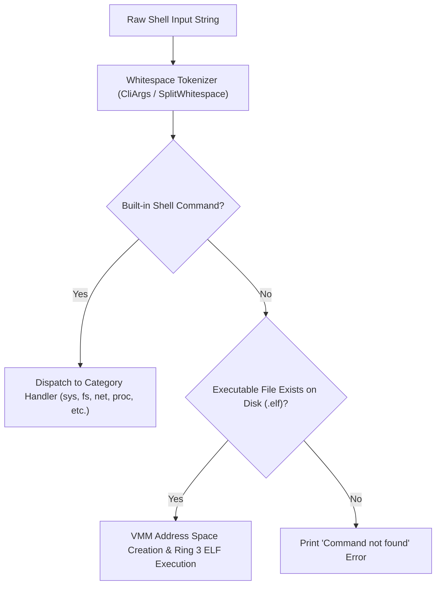

<!-- SPDX-License-Identifier: GPL-2.0-only -->

# Shell Command Dispatcher & Execution Pipeline

This document specifies the command parser, argument tokenizer, redirection router, and execution pipeline in `keira-shell`.

---

## Command Execution Architecture



---

## Technical Specifications

| Parameter | Specification | Description |
| :--- | :--- | :--- |
| **Line Buffer Capacity** | 256 bytes | Maximum length of single interactive command |
| **Max Arguments** | 16 positional arguments & flags | Statically bounded argument storage |
| **Privilege Escalation** | `please <command>` / `sudo` | Elevates administrative privileges for sensitive operations |

---

## Core API (`crates/shell/src/executor.rs`)

```rust
/// Parse and execute an input command line string.
pub fn execute_command(line: &str);

/// Check if active shell session possesses administrative privileges.
pub unsafe fn is_admin_mode() -> bool;
```
