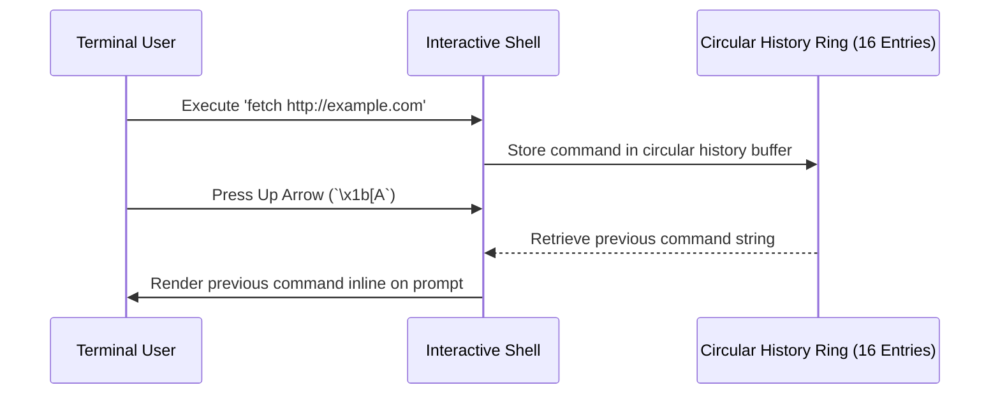

<!-- SPDX-License-Identifier: GPL-2.0-only -->

# Command Line History & Navigation

This document specifies the circular history buffer, arrow key navigation, and history persistence in `keira-shell`.

---

## History Navigation Flow



---

## Technical Specifications

| Parameter | Specification | Description |
| :--- | :--- | :--- |
| **Capacity** | 16 Command Entries | Circular overwrite ring buffer |
| **Entry Length** | 64 bytes per command | Statically allocated in kernel memory |
| **Navigation Keys** | Up Arrow (`\x1b[A`), Down Arrow (`\x1b[B`) | Standard ANSI escape sequences |

---

## Core API (`crates/shell/src/history.rs`)

```rust
/// Append a newly executed command line to the history buffer.
pub fn history_add(cmd: &str);

/// Navigate backwards in history (Up Arrow).
pub fn history_prev() -> Option<&'static str>;

/// Navigate forwards in history (Down Arrow).
pub fn history_next() -> Option<&'static str>;
```
