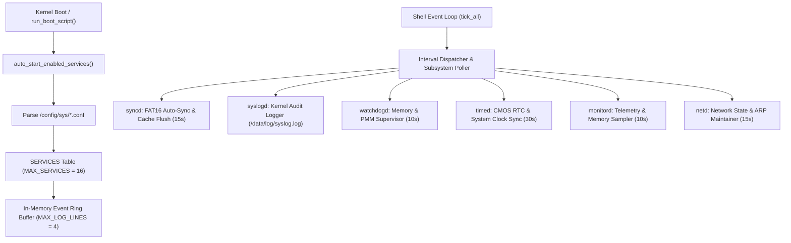

<!-- SPDX-License-Identifier: GPL-2.0-only -->

# Keira Service Controller (`ksvc`) & Background Daemons

This document specifies the internal architecture, configuration management, telemetry sampling, and runtime execution of background daemon services managed by `ksvc` in Keira Kernel.

---

## Service Controller Architecture



---

## Managed Built-In Services

| Service Name | Description | Default Port / Interval | Config File Path | Default State |
| :--- | :--- | :--- | :--- | :--- |
| **`syncd`** | FAT16 Auto-Sync & Dirty Cache Flush | Interval 15s | `/config/sys/syncd.conf` | Enabled |
| **`syslogd`** | Kernel Event & Audit Logger Service | Interval 5s | `/config/sys/syslogd.conf` | Enabled |
| **`watchdogd`** | Memory & Task Health Watchdog | Interval 10s | `/config/sys/watchdogd.conf` | Enabled |
| **`timed`** | CMOS RTC & System Clock Sync Daemon | Interval 30s | `/config/sys/timed.conf` | Enabled |
| **`monitord`** | System Health & Telemetry Daemon | Interval 10s | `/config/sys/monitord.conf` | Enabled |
| **`netd`** | Network State & ARP Cache Daemon | Interval 15s | `/config/sys/netd.conf` | Enabled |

---

## Configuration File Format (`.conf`)

Service configurations are serialized to `/config/sys/<service>.conf`:
```text
# Keira Service Configuration
name=syncd
description=FAT16 Auto-Sync & Cache Flush Daemon
enabled=1
auto_restart=1
interval=15
```

---

## Core API (`crates/shell/src/service/mod.rs`)

```rust
pub unsafe fn init();
pub unsafe fn auto_start_enabled_services();
pub unsafe fn start_service(name: &str) -> Result<(), &'static str>;
pub unsafe fn stop_service(name: &str) -> Result<(), &'static str>;
pub unsafe fn restart_service(name: &str) -> Result<(), &'static str>;
pub unsafe fn reload_service(name: &str) -> Result<(), &'static str>;
pub unsafe fn reset_service_stats(name: &str) -> Result<(), &'static str>;
pub unsafe fn enable_service(name: &str, enable: bool) -> Result<(), &'static str>;
pub unsafe fn tick_all();
```

---

## Interactive Shell Usage

```bash
# List all registered services and their real-time state
keira> ksvc list

# Display real-time cycle counts, intervals, uptime, and last events
keira> ksvc top

# Inspect detailed telemetry of a service
keira> ksvc status syncd

# View live service event logs from ring buffer and disk
keira> ksvc logs syslogd
keira> ksvc logs monitord

# Hot-reload configuration without restarting service
keira> ksvc reload syncd

# Reset performance and cycle counters
keira> ksvc reset timed

# Start, stop, or restart a background service
keira> ksvc start watchdogd
keira> ksvc stop syncd
keira> ksvc restart syncd

# Enable or disable service boot auto-start
keira> ksvc enable watchdogd
keira> ksvc disable syncd
```
