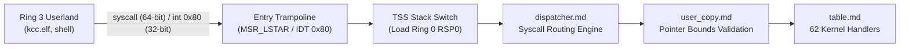

<!-- SPDX-License-Identifier: GPL-2.0-only -->

# Keira Kernel System Call Infrastructure

The `syscall` subsystem implements the boundary between unprivileged Userland (Ring 3) and privileged Kernel (Ring 0).

---

## Architecture & Transition Boundary

---

## Syscall Module Index

| Document | Component | Description |
| :--- | :--- | :--- |
| [`table.md`](table.md) | System Call Vector Table | Numerical vectors, argument types, and return values for system calls |
| [`dispatcher.md`](dispatcher.md) | Dispatcher & ABI | Syscall routing, register argument unpacking, and POSIX errno mapping |
| [`user_copy.md`](user_copy.md) | Validated Pointer Copying | Hardened memory transfer between Ring 0 and Ring 3 with boundary checks |
