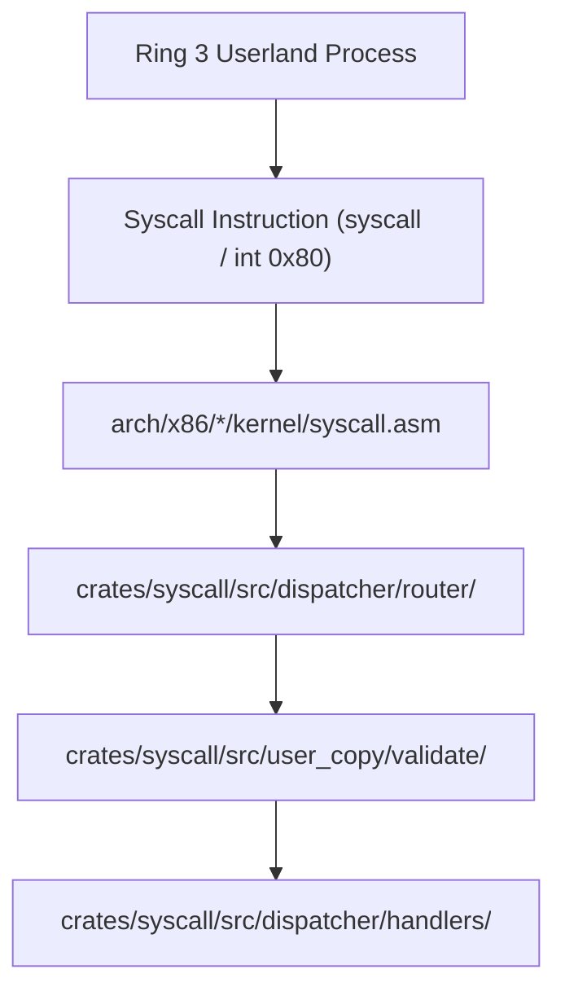

<!-- SPDX-License-Identifier: GPL-2.0-only -->

# Keira System Call Subsystem

The `syscall` domain provides the secure interface connecting unprivileged Ring 3 userland processes to Ring 0 kernel services.

---

## Syscall Architecture

---

## Submodule Index

| Submodule | Focus Area | Description |
| :--- | :--- | :--- |
| [`table/`](table/README.md) | Syscall Numbers | Vector definitions and standard POSIX syscall numbers |
| [`dispatcher/`](dispatcher/README.md) | Dispatch Engine | Syscall entrypoint, router, and category handlers |
| [`user_copy/`](user_copy/README.md) | Memory Safety | Validated user pointer bounds checking and copy primitives |
| [`exception/`](exception/README.md) | Exception Trapping | Hardware exception containment, core dump generation |
