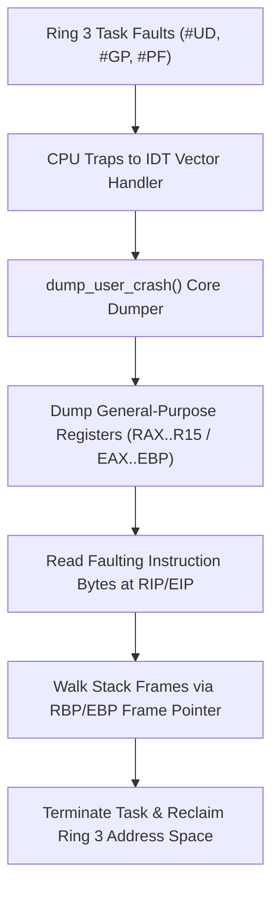

<!-- SPDX-License-Identifier: GPL-2.0-only -->

# System Call Dispatcher & Calling Conventions

This document details system call register ABIs, argument extraction, and error propagation in Keira Kernel.

---

## Dual-Architecture Register ABI

### 64-bit Architecture (`x86_64`)
* **Trigger**: `syscall` instruction.
* **Vector Number**: `RAX`.
* **Arguments**: `RDI` (arg 1), `RSI` (arg 2), `RDX` (arg 3), `R10` (arg 4), `R8` (arg 5), `R9` (arg 6).
* **Return Value**: `RAX` (negative error values encoded as `-errno`).
* **Preserved Registers**: Callee-saved registers (`RBX`, `RSP`, `RBP`, `R12`–`R15`).

### 32-bit Architecture (`i686`)
* **Trigger**: `int 0x80` instruction.
* **Vector Number**: `EAX`.
* **Arguments**: `EBX` (arg 1), `ECX` (arg 2), `EDX` (arg 3), `ESI` (arg 4), `EDI` (arg 5), `EBP` (arg 6).
* **Return Value**: `EAX`.

---

## Dispatcher Entry Point (`crates/syscall/src/dispatcher/mod.rs`)

```rust
#[no_mangle]
pub extern "C" fn syscall_dispatcher(
    num: u64,
    arg1: u64,
    arg2: u64,
    arg3: u64,
    arg4: u64,
    arg5: u64,
    arg6: u64,
) -> u64 {
    // 1. Audit system call vector number against table
    // 2. Validate Seccomp BPF security filters
    // 3. Dispatch to matching kernel subsystem
    // 4. Return result or encoded POSIX errno
}
```

---

## Ring 3 Exception Trapping & Core Dumper (`crates/syscall/src/exception/mod.rs`)

When an unhandled CPU exception (`#UD`, `#GP`, `#PF`) occurs within an unprivileged Ring 3 task, Keira isolates the fault, generates a formatted diagnostic core dump, and cleanly terminates the faulted task without compromising the kernel:



### Core Dumper Output Format:
- **Header**: Process ID, task name, and exception mnemonic (`#PF`, `#GP`, `#UD`).
- **Registers**: Full general-purpose register dump and flags register (`RFLAGS`).
- **Code Bytes**: 16 bytes of machine code centered at the faulting instruction pointer (`RIP`/`EIP`).
- **Stack Backtrace**: Stack frame unwinding printing up to 8 ancestor return addresses.

