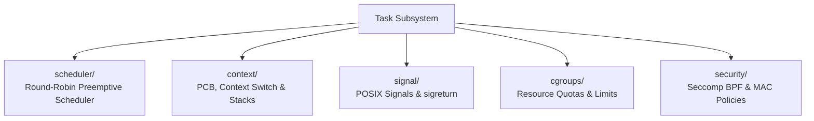

<!-- SPDX-License-Identifier: GPL-2.0-only -->

# Keira Task Management & Scheduling

The `task` domain governs process control blocks, preemptive scheduling, POSIX signal dispatch, cgroups resource controls, and security policies.

---

## Task Submodules

---

## Submodule Index

| Submodule | Focus Area | Description |
| :--- | :--- | :--- |
| [`scheduler/`](scheduler/README.md) | Task Scheduling | Preemptive round-robin scheduler, dispatch, lifecycle |
| [`context/`](context/README.md) | Task Context | Process Control Block (PCB), register frames, stack setup |
| [`signal/`](signal/README.md) | Signal Subsystem | POSIX signal delivery, signal masks, `sigreturn` frame |
| [`cgroups/`](cgroups/README.md) | Resource Control | Control groups, CPU quota throttling, process count limits |
| [`security/`](security/README.md) | Security Layer | Seccomp BPF syscall filter, Mandatory Access Control (MAC) |
