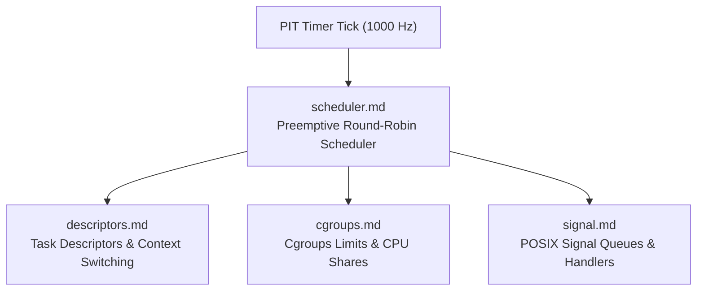

<!-- SPDX-License-Identifier: GPL-2.0-only -->

# Keira Kernel Task & Scheduling Subsystem

The `task` subsystem provides preemptive multitasking, round-robin scheduling, task control blocks (TCB), cgroups resource limits, and POSIX signal delivery.

---

## Subsystem Architecture

---

## Task Module Index

| Document | Component | Description |
| :--- | :--- | :--- |
| [`scheduler.md`](scheduler.md) | Preemptive Scheduler | Timer-tick driven context switching, runqueue management, and yield loops |
| [`descriptors.md`](descriptors.md) | Task Descriptors | `TaskControlBlock`, CPU register context (`TaskContext`), states, and file descriptors |
| [`cgroups.md`](cgroups.md) | Control Groups (Cgroups) | Resource quotas, CPU share scheduling, and memory ceiling limits |
| [`signal.md`](signal.md) | POSIX Signals | Signal masking, asynchronous delivery (`SIGINT`, `SIGKILL`, `SIGTERM`), and job tables |
