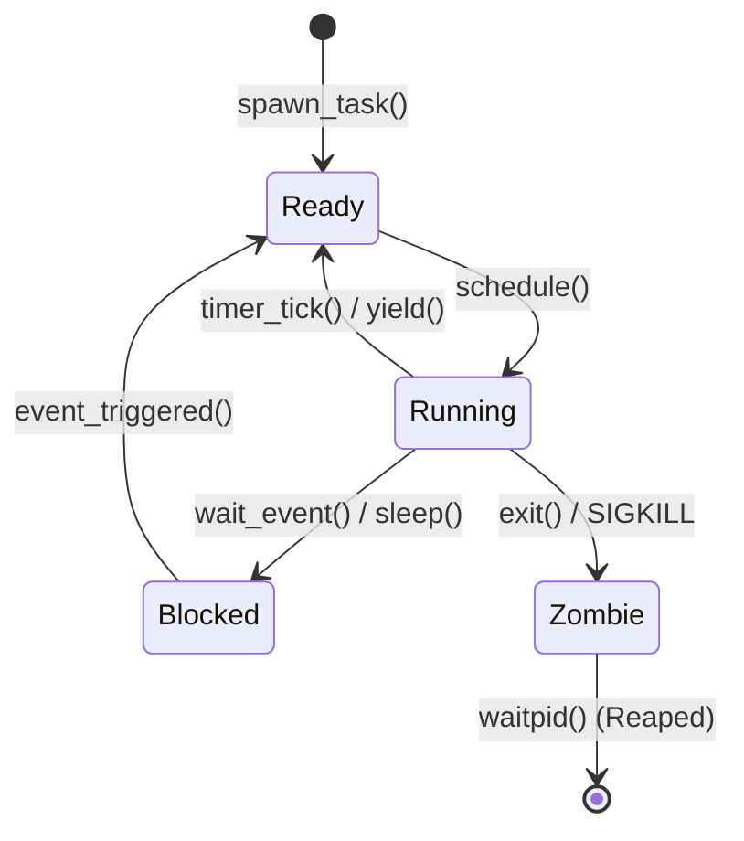

<!-- SPDX-License-Identifier: GPL-2.0-only -->

# Task Descriptors & Execution Context

This document details the Task Control Block (TCB), saved CPU registers, task state machines, and file descriptor tables in Keira Kernel.

---

## Task Control Block (TCB) Structure

```rust
pub struct TaskControlBlock {
    pub pid: u32,
    pub parent_pid: u32,
    pub state: TaskState,
    pub priority: u8,
    pub is_user: bool,
    pub page_table_root: usize, // CR3 register
    pub kernel_stack: usize,
    pub user_stack: usize,
    pub context: TaskContext,
    pub fds: [FileDescriptor; 16],
    pub pending_signals: u32,
    pub signal_mask: u32,
    pub name: [u8; 32],
}
```

---

## Task Lifecycle States


