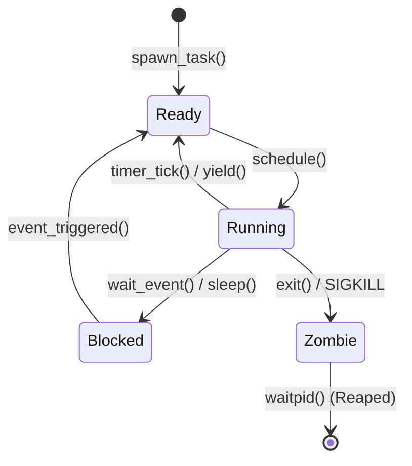

<!-- SPDX-License-Identifier: GPL-2.0-only -->

# Task Descriptors & Execution Context

This document details the Task Control Block (TCB), saved CPU registers, task state machines, and file descriptor tables in Keira Kernel.

---

## Task Control Block (TCB) Structure

```rust
pub const MAX_FDS: usize = 32;
pub const MAX_TASKS: usize = 64;

pub struct Task {
    pub id: usize,
    pub name: &'static str,
    pub rsp: u64,
    pub stack_addr: u64,
    pub state: TaskState,
    pub fds: [FileDescriptor; MAX_FDS],
    pub program_break: u64,
    pub program_break_start: u64,
    pub cwd: [u8; 128],
    pub cwd_len: usize,
    pub parent_id: usize,
    pub pml4_phys: u64,
    pub exit_code: i32,
    pub is_user: bool,
}
```

---

## Task Lifecycle States


