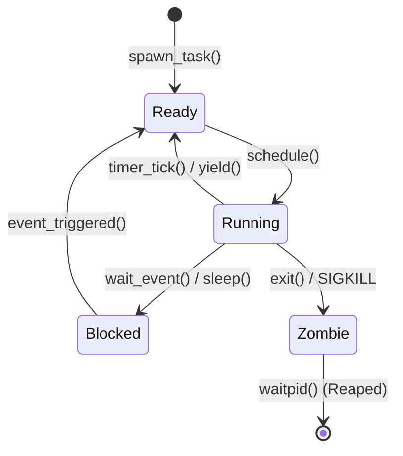

<!-- SPDX-License-Identifier: GPL-2.0-only -->

# Task Descriptors & Execution Context

This document details the Task Control Block (TCB), saved CPU registers, task state machines, and file descriptor tables in Keira Kernel.

---

## Task Control Block (TCB) Structure

```rust
pub const MAX_FDS: usize = 32;
pub const MAX_TASKS: usize = 64;

pub struct Task {
    pub id: usize,
    pub name: &'static str,
    pub rsp: u64,
    pub stack_addr: u64,
    pub state: TaskState,
    pub fds: [FileDescriptor; MAX_FDS],
    pub program_break: u64,
    pub program_break_start: u64,
    pub cwd: [u8; 128],
    pub cwd_len: usize,
    pub parent_id: usize,
    pub pml4_phys: u64,
    pub exit_code: i32,
    pub is_user: bool,
    pub uid: u32,
    pub gid: u32,
    pub euid: u32,
    pub egid: u32,
    pub saved_sigcontext: Option<InterruptContext>,
    pub signal_mask: u32,
    pub pending_signals: u32,
    pub is_orphan: bool,
}
```

---

## Task Lifecycle States



---

## Automatic Resource & Descriptor Reclamation

When a task transitions to `TaskState::Zombie` via `exit_current(exit_code)` or fatal exception signal:
1. **Open File Descriptors**: Every open descriptor entry in `task.fds` (`0..MAX_FDS`) is closed.
2. **Advisory File Locks**: Any active write lock held by the task is released via `keira_fs::lock::flock::release_lock` and `release_all_locks_for_task(idx)`.
3. **Subsystem Cleanup Hooks**: The registered `TASK_CLEANUP_HOOK` callback is dispatched:
   - Closes orphaned socket handles in `keira_net`.
   - Purges stale futex wait slots in `keira_ipc::futex`.
4. **Memory & Stack Reclamation**: Upon being reaped via `sys_waitpid()` or `reap_orphaned_zombies()`, the user PML4 page tables, demand-paged VMAs, and physical kernel stack frames are reclaimed to the PMM allocator.

---

## Descriptor Duplication & Lock Coherency (`dup` / `dup2`)

Keira supports descriptor cloning via POSIX Syscall 84 (`SYS_DUP`) and Syscall 85 (`SYS_DUP2`):
- **`SYS_DUP (oldfd)`**: Scans `0..MAX_FDS` for the lowest unallocated slot and copies descriptor metadata from `oldfd`.
- **`SYS_DUP2 (oldfd, newfd)`**: Atomically closes `newfd` (if previously open, releasing any held resources cleanly) and copies descriptor state to the requested `newfd` index.
- **Lock Coherency Invariant**: When an open file holds an exclusive advisory write lock (`flock`), duplicating the descriptor copies `write_mode` and the canonical file path. Closing one duplicated descriptor handle checks for sibling open descriptors for the same path in the task table; the write lock is released if and only if no other open descriptors hold the file in write mode.
