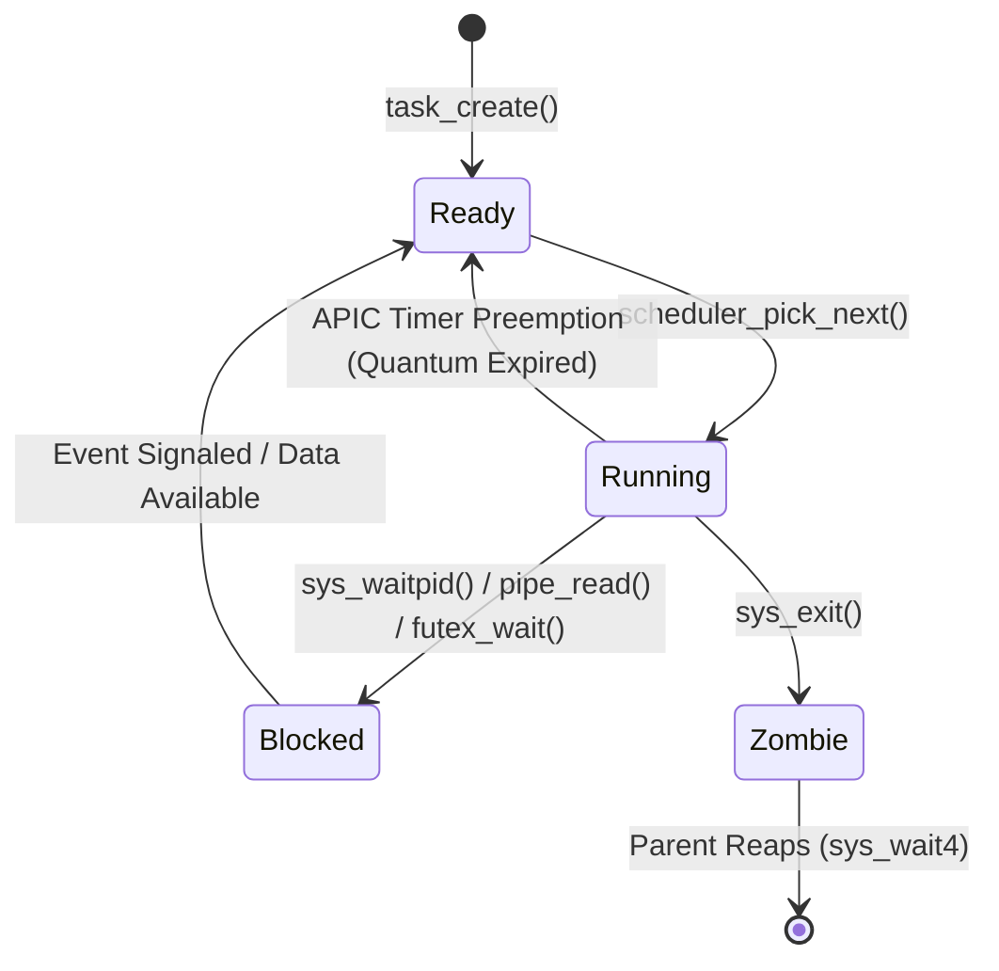

<!-- SPDX-License-Identifier: GPL-2.0-only -->

# Preemptive Task Scheduler Architecture

Keira features a preemptive multitasking engine with round-robin time slicing and priority class scheduling.

---

## 1. Task Lifecycle & State Machine



---

## 2. Task Control Block (TCB / TaskDescriptor)

Every thread or process is tracked by `TaskDescriptor` in `crates/task/src/context/`:

```rust
pub struct TaskDescriptor {
    pub pid: usize,
    pub ppid: usize,
    pub state: TaskState,
    pub priority: u8,
    pub time_slice_remaining: usize,
    pub cr3: usize,                     // Virtual address space page table
    pub kernel_stack_top: usize,        // RSP0 loaded into TSS on privilege change
    pub saved_context: CpuRegisters,    // Callee-saved registers during switch
    pub fd_table: Arc<Mutex<FdTable>>,  // File descriptor array
    pub pending_signals: u32,           // Signal bitmask
    pub signal_handlers: SignalTable,   // Registered sigaction handlers
}
```

---

## 3. Preemption & Context Switch (`switch_to`)

When the Local APIC timer fires an interrupt:
1. The CPU pushes `%cs`, `%rip`, `%rflags`, `%ss`, and `%rsp` onto the current task's kernel stack.
2. The ISR saves general-purpose registers (`%rax`, `%rbx`, `%rcx`, `%rdx`, `%rsi`, `%rdi`, `%rbp`, `%r8`-`%r15`).
3. The scheduler selects the next `Ready` task from the run queue.
4. If switching address spaces, `CR3` is reloaded with the target task's page directory.
5. The TSS `RSP0` pointer is updated to the target task's kernel stack top.
6. Callee registers are restored and `iretq` returns execution to the new task.
