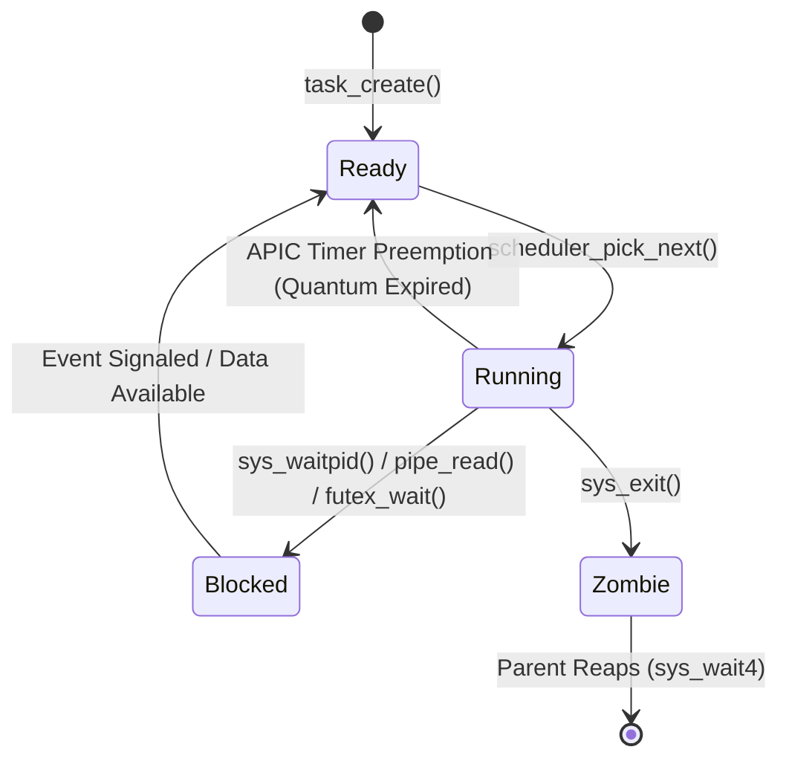

<!-- SPDX-License-Identifier: GPL-2.0-only -->

# Preemptive Task Scheduler Architecture

Keira features a preemptive multitasking engine with round-robin time slicing and priority class scheduling.

---

## 1. Task Lifecycle & State Machine


```mermaid
stateDiagram-v2
    [*] --> Ready: task_create()
    Ready --> Running: scheduler_pick_next()
    Running --> Ready: APIC Timer Preemption (Quantum Expired)
    Running --> Blocked: sys_waitpid() / pipe_read() / futex_wait()
    Blocked --> Ready: Event Signaled / Data Available
    Running --> Zombie: sys_exit()
    Zombie --> [*]: Parent Reaps (sys_wait4)
```

---

## 2. Task Control Block (TCB / Task)

Every thread or process is tracked by `Task` in `crates/task/src/types/task/descriptor.rs`:

```rust
pub struct Task {
    pub id: usize,
    pub name: &'static str,
    pub rsp: u64,
    pub stack_addr: u64,
    pub state: TaskState,
    pub fds: [FileDescriptor; MAX_FDS],
    pub program_break: u64,
    pub program_break_start: u64,
    pub cwd: [u8; 128],
    pub cwd_len: usize,
    pub parent_id: usize,
    pub pml4_phys: u64,
    pub exit_code: i32,
    pub is_user: bool,
    pub uid: u32,
    pub gid: u32,
    pub euid: u32,
    pub egid: u32,
    pub saved_sigcontext: Option<InterruptContext>,
    pub signal_mask: u32,
    pub pending_signals: u32,
    pub is_orphan: bool,
    pub cpu_ticks: u64,
    pub switches: u64,
}
```

---

## 3. Preemption & Context Switch (`switch_to`)

When the Local APIC timer fires an interrupt:
1. The CPU pushes `%cs`, `%rip`, `%rflags`, `%ss`, and `%rsp` onto the current task's kernel stack.
2. The ISR saves general-purpose registers (`%rax`, `%rbx`, `%rcx`, `%rdx`, `%rsi`, `%rdi`, `%rbp`, `%r8`-`%r15`).
3. The scheduler selects the next `Ready` task from the run queue.
4. If switching address spaces, `CR3` is reloaded with the target task's page directory.
5. The TSS `RSP0` pointer is updated to the target task's kernel stack top.
6. Callee registers are restored and `iretq` returns execution to the new task.
