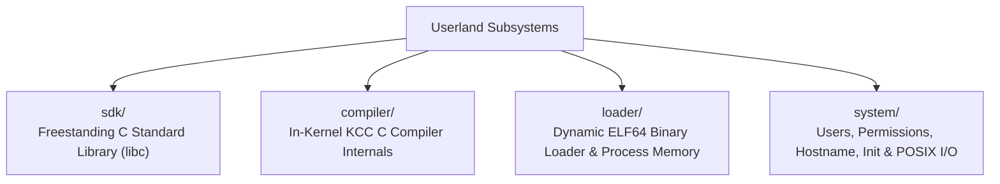

<!-- SPDX-License-Identifier: GPL-2.0-only -->

# Keira Kernel Userland Subsystems & C Toolchain

The `userland` documentation is hyper-modularized into 4 specialized domains covering the freestanding C SDK, in-kernel KCC C compiler, dynamic ELF loader, and userland system services.

---

## Userland Submodules

---

## Userland Module Index

| Submodule | Focus Area | Description |
| :--- | :--- | :--- |
| [`sdk/`](sdk/README.md) | Freestanding C SDK | Standard headers (`stdio.h`, `stdlib.h`, `string.h`, `math.h`, `ctype.h`, `syscall.h`) |
| [`compiler/`](compiler/README.md) | Native KCC Compiler | Lexer tokenization, recursive descent parser, and x86_64 code generator |
| [`loader/`](loader/README.md) | Dynamic ELF64 Loader | Program header validation, segment loading, address space setup, and rollback |
| [`system/`](system/README.md) | System Services | Multi-user database, file protection, network hostname, init process, and POSIX I/O |
