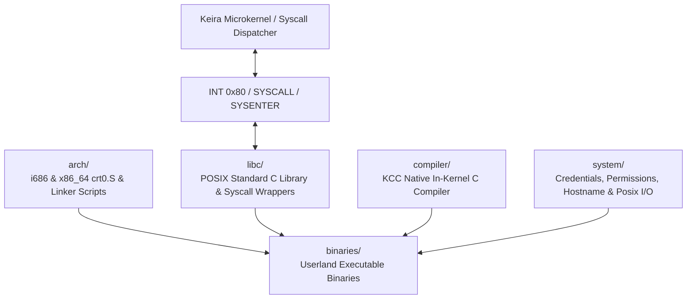

<!-- SPDX-License-Identifier: GPL-2.0-only -->

# Keira Userland Runtime, Native C Compiler & POSIX C Library

The `userland` domain comprises the Ring 3 execution environment, architecture bootstrap stubs, standard C library (libc), native C compiler (`kcc`), Ring 3 userspace binaries, and multi-user system configuration.

---

## Userland Subsystem Architecture

---

## Submodule Index

| Submodule | Focus Area | Description |
| :--- | :--- | :--- |
| [`arch/`](arch/README.md) | Architecture Stubs | CRT0 entry stubs (`crt0.S`) and ELF linker scripts (`linker.ld`) for i686 and x86_64 |
| [`libc/`](libc/README.md) | Standard C Library | Hyper-modular ISO C and POSIX libc routines, headers, and system call wrappers |
| [`compiler/`](compiler/README.md) | KCC Native Compiler | Preprocessor, recursive descent parser, lexer, AST, and x86 code generator |
| [`binaries/`](binaries/README.md) | Ring 3 Binaries | Native ELF executables: `kcc.elf`, `sysinfo.elf`, `test_abi.elf`, `fuzz_abi.elf` |
| [`system/`](system/README.md) | Userland Runtime | Multi-user credentials, file permissions, hostname configuration, and initialization |
